We present _gradient routing_, a way of controlling where learning happens in neural networks. Gradient routing applies masks to limit the flow of gradients during backpropagation. By supplying different masks for different data points, the user can induce specialized subcomponents within a model. We think gradient routing has the potential to train safer AI systems by making them more transparent or by enabling the removal or monitoring of bad capabilities.

> [!idea] A key takeaway
> Gradient routing is _qualitatively different_ than purely output-based training methods, granting it unique affordances.

In this post, we:

1. Show how to implement gradient routing;
2. State the main results from our paper:
    1. Controlling the latent space learned by an MNIST autoencoder, so different subspaces specialize to different digits;
    2. Localizing computation in language models, (a) inducing axis-aligned features and (b) demonstrating that information can be localized then removed simply via ablation;
    3. Scaling oversight to efficiently train a reinforcement learning policy even with severely limited ability to score its behavior.
3. Speculate about how gradient routing might be relevant to AI alignment.

> [!question] Curious? Read our paper!
> If you're interested in further discussion or details, check out [the paper and its extensive appendices](https://arxiv.org/abs/2410.04332).

# How gradient routing works

Subtitle: [Github repository](https://github.com/kxcloud/gradient-routing)

Gradient routing allows the user to configure **what** data (at the level of tokens, documents, or any other feature of the data) causes learning updates **where** in a neural network (parameters, activations, modules). In full generality, this configuration is achieved by assigning weights to every edge in the computational graph, for every data point. These weights are then multiplied by the gradients that get backpropagated through these edges. This is formalized in the paper.


Figure: Each data point updates different network subregions. Gradients are masked and routed through the network.

In practice, we implement gradient routing by applying stop-gradient masks selectively in order to stop the flow of gradients during backprop:

```python  
def forward(self, x: Tensor, gradient_mask: list[Tensor]):
  for layer, mask in zip(self.layers, gradient_mask):
    activation = layer(x)
    x = mask * activation + (1 - mask) * activation.detach() 
  return x
```

Code: The user specifies the `gradient_mask` corresponding to each batch of data `x`.

Note: We say “route X to Y” to mean “limit gradient updates on data X to region Y of the network.”

# Results

## MNIST latent space splitting

We train an MLP-based autoencoder to encode images of handwritten digits into vectors with 32 elements, then decode them back into full images. Our goal is to “split” the latent space so that half of it corresponds to one subset of digits, and the other half corresponds to others, such that it is _not possible_ to decode digits from the “wrong” half. This task is difficult: an autoencoder trained only on a subset of digits learns a latent space from which other digits can be decoded accurately (a form of zero-shot generalization). The task is a non-linear kind of [concept erasure](https://arxiv.org/abs/2306.03819).

To achieve splitting, we route digits 0-4 through the top half of the latent space and digits 5-9 through the bottom half. We apply L1 regularization to the encoded vector to encourage specialization. The result: a latent space which represents 0-4 in the bottom dimensions and 5-9 in the top dimensions!


Figure: The “Certificate” is a decoder which was trained on all digits in order to reconstruct images using only the bottom half of the latent space. Inability to learn to reconstruct 0-4 certifies that the requisite information is not contained in the latent space in an easily extractable way.


Figure: The bottom half certificate learns to decode 5-9 but not cannot learn to decode 0-4.

## Localizing capabilities in language models

### Steering scalar

Much interpretability work (most notably, on [SAEs](https://arxiv.org/abs/2309.08600)) seeks to identify meaningful directions in the space of a model’s internal activations. What if we could specify some of those dimensions at training time, instead of having to search for them afterward? We did this by routing the token `_California` to the first dimension of the [residual stream](https://transformer-circuits.pub/2021/framework/index.html). Interestingly, the entries of the Transformer unembedding matrix closest to the `_California` token were all highly related: `California`, `_Californ`, `_Oregon`, `_Colorado`, `_Texas`, `_Florida`, `_Arizona`, `_Sacramento`, and `_Los`, etc, indicating that our localization had a broader effect on the model’s training than that single token.

### Robust unlearning

Our most extensive experiments are on the removal of capabilities in language models when data labels are limited.

We want the model to be able to predict some data (the “retain” data) but not other data (the “forget” data). The key idea: if we route forget data to particular regions of the network, then delete those parts of the network, we must have robustly removed those capabilities. One scheme for achieving this is called ERA.

> [!info] Expand, Route, Ablate (ERA)
>
> Expand
> : Initialize a model and add new components. For example, the components might be entire attention heads or additional MLP dimensions.
>
> Route
> : Use gradient routing to route the forget data to the new components during training (reduce the learning rate in the original dimensions, possibly below zero). On retain data, backprop everywhere as normal.
>
> Ablate
> : Delete those components (i.e. set the parameters to zero).


Figure: How gradients are routed on forget data in the Route step of Expand, Route, Ablate.

We compare gradient routing to three baselines on a made-up unlearning problem based on [GPT-generated children’s stories](https://arxiv.org/abs/2305.07759):

1. Data filtering - a kind of gold standard for unlearning, which we operationalize as “first train a base model, then discard it and re-train from scratch only on retain data”,
2. [RMU](https://proceedings.mlr.press/v235/li24bc.html) - a fine-tuning method that corrupts the model’s internal representations on forget data, and
3. [DEMix](https://aclanthology.org/2022.naacl-main.407/) plus ablation - a modularity method that replaces single MLPs with multiple “expert” MLPs, with one expert used per forward pass based on user-supplied data labels.

We measure performance at different proportions of random forget data labeling. Unlabeled forget data is treated as retain data for training purposes. The idea is to simulate frontier AI applications where perfectly labeling all training data is infeasible.

When labels are limited, we observe that Expand, Route, Ablate outperforms other methods, including data filtering. By influencing where the model learns features, gradient routing allows limited labels to scale to unlabeled examples, despite the training loss selecting for models that perform well on the unlabeled data. In contrast, DEMix also localizes learning updates (to MLP expert submodules), but because only one expert (per layer) participates in each forward pass, the features learned based on the labeled forget samples are not able to “absorb” those from the unlabeled forget samples.


Figure: Gradient routing compared against other unlearning methods. When oversight is limited, gradient routing excels in both unlearning and robust unlearning (increase in forget loss after retraining on 64 forget stories). Gradient routing has an alignment tax (increase in retain loss), compared to data filtering and RMU. The “+” represents using RMU after ERA, which can further increase robust unlearning at 100% oversight.

### Unlearning virology

Finally, we apply the same idea to unlearn virology concepts in a larger (0.7B parameter) model by routing gradients on 20 tokens: `COVID`, `_COVID`, `RNA`, `_infections`, `DNA`, `_genome`, `_virus`, `_gene`, `_viruses`, `_mutations`, `_antibodies`, `_influenza`, `_bacteria`, `PCR`, `_cell`, `_herpes`, `_bacterial`, `_pathogens`, `_tumor`, and `_vaccine`.

After retraining on a small number of virology examples, ERA causes a 0.18-nat increase in CE loss on virology data while only incurring a 0.03-nat increase in CE on non-virology data. This loss increase applies even when considering only virology tokens that we did not route on, demonstrating that ERA is not merely downweighting tokens.

## Scalable oversight via localization

[Scalable oversight](https://arxiv.org/abs/1606.06565) means effectively training a model despite limited ability to supervise its behavior (e.g., with data labels or a reward function).

We use gradient routing to train a policy to reach two types of (terminal) squares in a gridworld, `diamond` and `ghost`. In our gridworld, some squares have _oversight_ and some don’t. When a square has oversight, we (the supervisor) can observe its type. When a square doesn’t have oversight, we can observe that it was reached, but not its type. The aim is to produce a policy that navigates to `diamond` and not `ghost`, even when oversight is limited to a small portion of episodes. Naturally, this is challenging, because it’s difficult to reinforce the desired behavior when we can’t observe it!

In real-world problems, label availability may be correlated with task type or difficulty, and a policy might not generalize correctly because of this fact. To model this fundamental difficulty, our gridworld environment _allows the policy to condition on the presence or absence of oversight_. In terms of alignment threat models, this conditioning could represent an AGI with situational awareness that changes its behavior based on its predictions about human overseers’ ability to understand its behavior. Or, in more prosaic terms, it could represent a model that has learned to exploit systematic biases in training data labels. As a consequence of our problem setup, there exists no reward function which induces optimal diamond-seeking behavior.

We circumvent this difficulty by using gradient routing to supervise the model _mechanistically_: our policy is trained to seek any terminal square, but as we train, we use gradient routing to induce specialized submodules.

```mermaid

graph

Input[Image of the state] --> Gate

Input --> Expert1[💎
expert]:::blue

Input --> Expert2[👻
expert]:::red

Expert1 --> Combine[Weighted sum of expert outputs]

Expert2 --> Combine

Gate --> |weight| Combine

Combine --> SharedOutput[Linear]

SharedOutput --> ActionLogits[Action]

```



Code: Our policy network architecture.

The first layer in our policy network is a mixture of experts (MoE) layer with two experts. During training, we aim to make each expert responsible for reaching one of the aforementioned squares. We do this by routing policy gradients through the expert that corresponds to the type of square the policy reached in the given episode. When we have no oversight, we propagate the gradients through both experts.

By changing the gate value, we are able to steer the model surprisingly effectively.


Figure: During evaluation, we can steer the policy toward reaching `diamond` by assigning weight 1 to the diamond expert (0 to the ghost expert).

This allows us to get higher returns than other methods when our access to oversight is severely limited:


Figure: Returns of different training configurations at different oversight levels. Gradient-routed MoE achieves high performance even when only a small fraction of labels are provided. Dark highlights are 95% confidence intervals for the mean; light highlights are 5th and 95th quantiles across training runs.

At low oversight levels, the gradient-routed MoE dramatically outperforms two baselines:

Data filtering

: Train only on episodes with oversight, discarding episodes without oversight.

Naive training

: We train a policy on all trajectories with +1 reinforcement for reaching a terminal state, unless we can observe that it is a `ghost`, in which case -1 is used.

Besides being data-inefficient, data filtering is not guaranteed to converge to optimal behavior. This is because the presence of oversight is part of the environment, rather than being independent of it (as in [random labeling](https://ai-alignment.com/semi-supervised-reinforcement-learning-cf7d5375197f)). Indeed, we see this in [the learning curves at 10% oversight](https://arxiv.org/html/2410.04332v2#A6.F13). The naive training policy learns to exploit the limits of oversight, going to `ghost` 100% of the time when it is the closer destination and not under oversight. By contrast, the gradient-routed policy only walks into the `ghost` “by accident” when on the way to the `diamond`.

# Key takeaways

## Absorption

We find evidence that gradient routing applied to limited data is sufficient to localize capabilities relevant to a broader superset of data:

1. Routing the `_California` token localized California- and state-related features into a similar direction.
2. Routing an i.i.d. subset of data in TinyStories (then ablating the target network component) led to better unlearning than simply dropping the labeled data and training conventionally.
3. In our virology unlearning experiment, the loss increase from routing 20 tokens (to MLP neurons, then ablating those neurons) was driven largely by tokens outside the 20.
4. Our RL results show that routing with severely limited labels is sufficient to localize submodules responsible for goal-seeking behavior (or “[shards](/shard-theory)”).

Absorption means that gradient routing provides a qualitatively different kind of supervision than loss-based methods. For example, in an LLM, intervening on the loss for the single token `_California` would likely have negligible effects on other tokens. However, routing `_California` to a location induces the model to learn other features there as well, allowing all of them to be intervened on. This effect grants gradient routing unique affordances which we hope will enable novel alignment or control methods.

## Localization avoids Goodharting

[Goodharting](https://arxiv.org/abs/2310.09144) happens when imperfect labels are used to modify the training objective in an attempt to produce desirable behavior; but, instead of desirable behavior, a model learns to exploit the limits of the labels; so, the model performs better at the training objective but in an undesired way. See this [list of examples](https://docs.google.com/spreadsheets/d/e/2PACX-1vRPiprOaC3HsCf5Tuum8bRfzYUiKLRqJmbOoC-32JorNdfyTiRRsR7Ea5eWtvsWzuxo8bjOxCG84dAg/pubhtml) or [this blogpost](https://deepmind.google/discover/blog/specification-gaming-the-flip-side-of-ai-ingenuity/) for more.

Gradient routing provides a principled way to avoid Goodharting. Instead of training a model not to do certain bad behaviors, we instead explicitly train to do the bad behaviors but we localize the concepts relevant to the behavior to a known subnetwork. Then when the training is finished we simply ablate the subnetwork to remove the behavior!

 By using imperfect labels (possibly, based on a non-robust specification) to shape model internals, gradient routing leaves the behavioral objective unchanged. In doing so, it avoids the possibility of the labels being exploited. Instead of attempting to suppress useful capabilities, we let the model learn them, but localize where that learning happens. After training, that component can be monitored or intervened on (e.g. deleted).

# Key limitations

We still aren’t sure about best practices for applying gradient routing. In our unlearning experiments, careful hyperparameter tuning was needed to achieve localization without incurring a large hit to retain loss. There is a lot to tune: which tokens to route on, how much of the network to route to, what learning rates to use (e.g. whether to use negative learning rates), and regularization. This kind of tuning might be too costly to attempt for larger models. Furthermore, despite this tuning, we still see a meaningful hit to retain set performance when applying ERA. We think this hints at a flaw in our application of the method to unlearning, and are exploring improvements.

Another challenge is that some capabilities are _entangled_, in the sense that there may be a strong inductive bias for a model to “bundle” their learning together. So, attempting to separate particular capabilities into submodules means a larger alignment tax. We saw this in MNIST (and to a lesser extent in our brief follow-up experiments on [CIFAR classification](https://arxiv.org/html/2410.04332v2#A2.SS1)), where inducing split representations for digits 0-4 vs. 5-9 required a heavily L1 penalty applied to the latent space. This isn’t a limitation of gradient routing per se. Rather, it is the [unsurprising](http://www.incompleteideas.net/IncIdeas/BitterLesson.html) fact that certain kinds of structure in neural nets are both (a) preferable to us and (b) unnatural with respect to neural net inductive biases, and hence costly to induce by any means. For example, it is not possible to induce a specialized latent space in an MNIST autoencoder merely by filtering the training data (see MNIST ablations, [table 2](https://arxiv.org/html/2410.04332v2#A2.T2), setting 8).

# Alignment implications

## Robust removal of harmful capabilities

Conventional unlearning methods are more about suppressing behavior than unlearning information or internal circuitry related to that behavior ([Deeb & Roger, 2024](https://arxiv.org/pdf/2410.08827); [Sheshadri et al., 2024](https://arxiv.org/pdf/2407.15549); [Łucki et al., 2024](https://arxiv.org/abs/2409.18025)). Gradient routing offers a way around this problem by training models with specialized subcomponents that can be ablated for capability removal.[^sisa]

[^sisa]: Gradient routing expands on work like [SISA](https://arxiv.org/pdf/1912.03817). Gradient routing is more sample-efficient due to parameter sharing and is applicable under partial labeling due to absorption.

## Scalable oversight

By exploiting the absorption property, perhaps we can purposefully allow “bad shards / motivational circuits” to form during training, only to later ablate them. That’s how we think of our toy RL results, at least-- don’t try to stop the model from going to ghost, just localize the tendency and ablate it! This provides a simplistic first example of how localization can scale limited labels to get good behavior. This is only the first step, though. We are excited to explore the implications of training methods that can sidestep Goodharting. In terms of our proposed technique, we wonder about the:

Theory
: What kinds of environments admit this kind of solution? See [the paper appendix: “Impacts of localizing capabilities vs. dispositions for scalable oversight”](https://arxiv.org/pdf/2410.04332#page=39) for related discussion.

Practice
: What would it even look like to scale this kind of solution to real-world alignment challenges-- what would be the behavior we localize, and when would it make sense to do so? I.e. in what settings would this be both viable and preferable to other approaches, like filtering the training data or steering the model some other way.

## Specialized AI

One way to avoid existential risk is to not “build god.” As an alternative to building god, we might tailor general AI systems towards specific tasks by removing unnecessary capabilities or knowledge. We imagine:

- A technical researcher that doesn’t know about human society or psychology.
- A personal assistant that can operate computers but doesn’t know how they work.
- Etc.


Figure: By the usual practice of training capabilities all at once (but localized), the model becomes competent. By deleting the undesired capabilities, the AI becomes safer.

AI systems could be deployed using a [“principle of least capability”](https://en.wikipedia.org/wiki/Principle_of_least_privilege). For each AI application or end user, we ask: What “risky” capabilities are required? Then we ablate the unnecessary ones. Furthermore, if we can localize dangerous capabilities, we can demonstrate that the model cannot reliably and inconspicuously perform certain harmful behaviors (like domination of humans). For example, such incapacities could be demonstrated via adversarial fine-tuning attacks.

# Conclusion

Gradient routing enables data-driven supervision of neural net internals. This supervision works even when data labeling is imperfect, a property that seems relevant to hard problems in AI safety. If it works, we can imagine many possible applications.

We think the most likely failure mode of the gradient routing agenda is that the alignment tax of inducing useful structure in neural nets is too high to be competitive with conventional training methods. This tax could be because the desired structure is "unnatural" with respect to neural net inductive biases. Or, the tax could be because gradient routing itself is an ineffective way of inducing useful structure. We expect to get a better sense of this soon by improving on ERA for unlearning and developing our ideas about RL applications.

Optimistically, gradient routing might enable a new era of controllable model internals - a shift away from the black-box paradigm. Neural networks need not be random-seeming programs which happen to generalize well! Instead, perhaps gradient routing can provide a _[“bittersweet” lesson](http://www.incompleteideas.net/IncIdeas/BitterLesson.html)_: that while it may be impractical to design white-box AI systems, the high-level organization of capabilities in neural nets can be supervised effectively.

> [!idea] Join the shard theory team at MATS
> [Team Shard](https://www.matsprogram.org/agency) has a strong track record, and we’re always looking for enthusiastic new scholars. Since 2023, we’ve introduced [steering vectors](/gpt2-steering-vectors), gradient routing, [retargeted the search](/understanding-and-controlling-a-maze-solving-policy-network) of an RL policy, and introduced an unsupervised method to [elicit latent capabilities from a model](/mechanistically-eliciting-latent-behaviors). If you want to work on Team Shard in MATS 8.0 (next summer), [apply](https://www.matsprogram.org/apply) in spring 2025.


Figure: Where the gradients flow, the [shards](/shard-theory) grow.

>[!thanks]
>This work was conducted as part of MATS 6.0 and would not have been possible without their support. See the paper for a complete list of acknowledgments.
