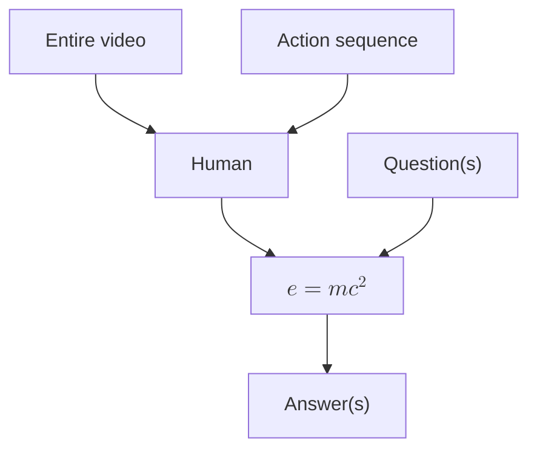

This page is inspired by Gwern Branwen's [Lorem Ipsum](https://gwern.net/lorem), which serves a similar purpose.

# Quotations

> Perhaps one did not want to be loved so much as to be understood.
>
> -- Orwell, _1984_

<hr/>

> A scrupulous writer, in every sentence that he writes, will ask himself at least four questions, thus:
>
> 1. What am I trying to say?
> 2. What words will express it?
> 3. What image or idiom will make it clearer?
> 4. Is this image fresh enough to have an effect?
>
> And he will probably ask himself two more:
>
> 1. Could I put it more shortly?
> 2. Have I said anything that is avoidably ugly?
>
> But you are not obliged to go to all this trouble. You can shirk it by simply throwing your mind open and letting the ready-made phrases come crowding in.
>
> -- Orwell's [_Politics and the English Language_](https://www.orwellfoundation.com/the-orwell-foundation/orwell/essays-and-other-works/politics-and-the-english-language/)

# $\KaTeX$ math mode

Math coloring is automatically translated to accord with site styling: ${\color{red}x}={\color{blue}y}$. I mean, seriously, who wants to read text that looks like <em><span style="color:#ff0000;">this</span></em>? 🤡

# Spoilers

I couldn't find a `rehype` or `remark` plugin I liked, so I produced my own. This spoiler is unobtrusive and fits in with the broad site aesthetic.
>! Snape kills Dumbledore.

The following spoiler box is larger:
>! There can even be multiline spoilers! 
>
>! This should be in another `<p>` element.
>
>! *This starts with emphasis*.

# Mermaid diagrams

Code: An example [Mermaid](https://mermaid.js.org/) diagram. Mermaid even supports $\KaTeX$!

# Smart quotes

I wrote a [`rehype`](https://www.npmjs.com/package/rehype) plugin which scans my website and adjusts quote marks so that they are properly oriented. The plugin also moves around punctuation so that periods are generally inside of quotations while webpage commas are generally outside. For example:

- I said "hi there," but he couldn't hear me.
- "Why don't you just tell him 'I love you'?"
- ("Don't do it," they said...)
- "'There's a good boy' is what I tell my dog when he behaves."
- "I never again want to hear 'I lost the game'."
- I love Bryan Adam's [_Summer of '69_](https://www.youtube.com/watch?v=eFjjO_lhf9c)[^69]
  [^69]: Seriously, this song is a banger.

In fact, all of the bullet points were written so that the rules were violated. This page should still render them properly. However, this functionality should not apply within code blocks:

- `results['column']`
- `'` and `"hi"` and `'hi'`
- `print('honk!')`
- `print("honk!")`
# Markdown captions for tables and figures

The [`remark-captions`](https://npmjs.com/package/remark-captions) package makes it easy to add captions. 

![[https://assets.turntrout.com/static/images/posts/goose-majestic.avif|Sample image of a majestic goose.]]
Figure: The most _majestic_ animal known to humanity.


| Left  | Right |
| :---: | :---: |
| Lower | text  |

Table: This is a table caption. *Emphasis* and **bolding** are preserved.

```typescript 
/**
 * Replaces number-preceding hyphens with minus signs (−).
 *
 * @param {string} text
 * @returns {string} The modified string
 */
const minusReplace = (text: string): string => {
  const numberMatch = /(^|\s)\-(\s?\d*\.?\d+)/g
  return text.replace(numberMatch, "$1−$2")
}
```
Code: Part of [my website processing pipeline](https://github.com/alexander-turner/TurnTrout.com/blob/main/quartz/plugins/transformers/minus_sign.ts).
# Smart dash conversion

[Merriam-Webster ordains that](https://www.merriam-webster.com/grammar/em-dash-en-dash-how-to-use) - contrary to popular practice - hyphens (-) and em-dashes (—) be used in importantly different situations:

> [!quote] [How to Use Em Dashes (—), En Dashes (–) , and Hyphens (-)](https://www.merriam-webster.com/grammar/em-dash-en-dash-how-to-use)
> The em dash (—) can function like a comma, a colon, or parenthesis. Like commas and parentheses, em dashes set off extra information, such as examples, explanatory or descriptive phrases, or supplemental facts. Like a colon, an em dash introduces a clause that explains or expands upon something that precedes it.

My `formatting_improvement_html.ts` contains `hyphenReplace`, which prevents clauses from being delimited by hyphens ("`I - like you - object`"). Instead, the build process renders "I - like you - object."

# SMALLCAPS appear in the table of contents
## As do "smart quotes"
Test of [mail favicon](mailto:throwaway@turntrout.com) - the `svg` should be floating next to the URL.
### Subsubsection

# Smallcaps

The build process detects acronyms ("HTML") and abbreviations ("100GB") and then tags them with the `small-caps` class. The CSS then styles the tagged elements in smallcaps. There are a lot of acronyms on my site, so it's very nice to not have to tag them manually![^smallcaps]

> [!quote] NAFTA, [Wikipedia](https://en.wikipedia.org/wiki/North_American_Free_Trade_Agreement)
> The **North American Free Trade Agreement** (**NAFTA** [/ˈnæftə/](https://en.wikipedia.org/wiki/Help:IPA/English "Help:IPA/English") [_NAF-tə_](https://en.wikipedia.org/wiki/Help:Pronunciation_respelling_key "Help:Pronunciation respelling key"); [Spanish](https://en.wikipedia.org/wiki/Spanish_language "Spanish language"): *Tratado de Libre Comercio de América del Norte*, **TLCAN**; [French](https://en.wikipedia.org/wiki/French_language "French language"): *Accord de libre-échange nord-américain*, **ALÉNA**) was an agreement signed by [Canada](https://en.wikipedia.org/wiki/Canada "Canada"), [Mexico](https://en.wikipedia.org/wiki/Mexico "Mexico"), and the  [United States](https://en.wikipedia.org/wiki/United_States "United States") that created a trilateral [trade bloc](https://en.wikipedia.org/wiki/Trade_bloc "Trade bloc") in [North America.](https://en.wikipedia.org/wiki/North_America "North America") The agreement came into force on January 1, 1994, and superseded the 1988 [Canada–United States Free Trade Agreement](https://en.wikipedia.org/wiki/Canada%E2%80%93United_States_Free_Trade_Agreement "Canada–United States Free Trade Agreement") between the United States and Canada. The NAFTA trade bloc formed one of the largest trade blocs in the world by [gross domestic product.](https://en.wikipedia.org/wiki/Gross_domestic_product "Gross domestic product")

[^smallcaps]: Here's a footnote![^nested] 

	This footnote has multiple paragraphs.
[^nested]: And a footnote created within another footnote!

## Font adjustments

The site's font family is [EB Garamond](http://www.georgduffner.at/ebgaramond). However, as of April 2024, the font did not support slashed zeroes (the `zero` feature). The unslashed zeroes looked quite similar to the letter 'o.' Furthermore, the italicized font did not support the `cv11` OpenType feature for oldstyle numerals (such as '2', which only reach up to the x-height of lowercase letters). This meant that the italicized oldstyle '1' looked like a small uppercase 'I', which wasn't very pleasant to my eyes.

Therefore, I paid [Hisham Karim](https://www.fiverr.com/hishamhkarim) $121 to add these features. I have notified the maintainer of the EB Garamond font. 😌

## Automatic fraction display

> 99 1/2% of websites don't render fractions properly.
> -- Albert Einstein

I chose slanted fractions in order to slightly increase the height of the numerals in the numerator and denominator. People are 2/3 water, but "01/01/2000" should not be rendered as a fraction.

- Multiplication sign conversion makes multipliers exactly 2x as pleasant to read. See also: 5/4x.
- Full-width slashes are used for separators like "cat" / "dog."

# Text styling
_Italics **Bold Italics**_ **Bold** Normal
# Lists

> [!quote] [List of weapons and armour in Middle-earth](https://en.wikipedia.org/wiki/List_of_weapons_and_armour_in_Middle-earth)
>
> <dl>
>   <dt>Sword</dt>
>   <dd>
>     <ul>
>       <li>Noldorin Sindarin: <span className="elvish">magl</span>, <span className="elvish">magol</span></li>
>       <li>North Sindarin: <span className="elvish">magor</span></li>
>       <li>Quenya: <span className="elvish">makil</span>, <span className="elvish">macil</span></li>
>       <li>Specific types of sword were named   <span className="elvish">lango</span> (broad sword), <span className="elvish">eket</span>, <span className="elvish">ecet</span> (short sword), and <span className="elvish">lhang</span> (cutlass, sword)</li>
>     </ul>
>   </dd>
>   
>   <dt>Dagger, knife</dt>
>   <dd>
>     <ul>
>       <li>Noldorin Sindarin: <span className="elvish">sigil</span></li>
>       <li>Quenya: <span className="elvish">cirma</span>, <span className="elvish">sicil</span></li>
>     </ul>
>   </dd>
>   
>   <dt>Axe</dt>
>   <dd>
>     <ul>
>       <li>North Sindarin: <span className="elvish">hathol</span></li>
>       <li>Quenya: <span className="elvish">pelekko</span> (Hooker notes the similarity of the Greek πέλεκυς pélekys: double-headed axe)</li>
>     </ul>
>   </dd>
>   
>   <dt>Spear</dt>
>   <dd>
>     <ul>
>       <li>Quenya: <span className="elvish">hatal</span> also <span className="elvish">nehte</span></li>
>     </ul>
>   </dd>
>   
>   <dt>Bow</dt>
>   <dd>
>     <ul>
>       <li>Noldorin Sindarin: <span className="elvish">peng</span> also poetically <span className="elvish">cû</span> (“arch”)</li>
>       <li>Quenya: <span className="elvish">quinga</span></li>
>     </ul>
>   </dd>
>   
>   <dt>Arrow</dt>
>   <dd>
>     <ul>
>       <li>Quenya: <span className="elvish">pilin</span>, pl. <span className="elvish">pilindi</span></li>
>     </ul>
>   </dd>
> </dl>

Unordered lists:

- First level
  - Second level
    - Third level
      - Fourth level (it's kinda cringe if lists get this deep, though)
  - Second level

> 1. Never use a metaphor, simile or other figure of speech which you are used to seeing in print.
> 2. Never use a long word where a short one will do.
> 3. If it is possible to cut a word out, always cut it out.
> 4. Never use the passive where you can use the active.
> 5. Never use a foreign phrase, a scientific word or a jargon word if you can think of an everyday English equivalent.
> 6. Break any of these rules sooner than say anything outright barbarous.

> Blockquotes admit nicely formatted lists as well!
>
> 1. This is a list item.
>    1. And now it's nested.
>       1. And now it's double nested.
> 1. Hopefully this is bullet number two!

# Images
Before commits are pushed to GitHub, images are converted to AVIF for better compression. JPEGs and PNGs experience a 2-20x compression ratio. I refuse to have an unresponsive site!

# Admonitions

> [!abstract]

> [!note]

> [!info]

> [!example]

> [!quote]
> A man may take to drink because he feels himself to be a failure, and then fail all the more completely because he drinks. It is rather the same thing that is happening to the English language. It becomes ugly and inaccurate because our thoughts are foolish, but the slovenliness of our language makes it easier for us to have foolish thoughts. The point is that the process is reversible.

> [!quote]- Hagrid
> 
> Yer a wizard, Harry. And I'm in what they call er "collapsing admonition."

> [!tip] [This dummy link should be colored according to the admonition type.](/test-page)
>
> > What is above all needed is to let the meaning choose the word, and not the other way about. In prose, the worst thing one can do with words is to surrender to them. When you think of a concrete object, you think wordlessly, and then, if you want to describe the thing you have been visualising, you probably hunt about till you find the exact words that seem to fit it. When you think of something abstract you are more inclined to use words from the start, and unless you make a conscious effort to prevent it, the existing dialect will come rushing in and do the job for you, at the expense of blurring or even changing your meaning.
> >
> > Probably it is better to put off using words as long as possible and get one's meanings as clear as one can through pictures and sensations. Afterward one can choose – not simply *accept* – the phrases that will best cover the meaning, and then switch round and decide what impression one's words are likely to make on another person. This last effort of the mind cuts out all stale or mixed images, all prefabricated phrases, needless repetitions, and humbug and vagueness generally.
>
> Note how the left border is a muted shade of the admonition color.

> [!goose]
> Geese are better than dogs.

> [!idea]


> [!todo]

> [!question]

> [!warning]

> [!failure]

> [!danger]

> [!bug]

> [!thanks]

> [!success]

# Twemoji

I prefer the flat style of Twitter emoji. This also unifies UX across devices, as emoji are not rendered in a browser- or OS-specific fashion.

🪿😀😃😄😁😆😅😂🤣🥲🥹☺️😊😇🙂🙃😉😌😍🥰😘😗😙😚😋😛😝😜🤪🤨🧐🤓😎🥸🤩🥳🙂‍↕️😏😒🙂‍↔️😞😔😟😕🙁☹️😣😖😫😩🥺😢😭😮‍💨😤😠😡🤬🤯😳🥵🥶😱😨😰😥😓🫣🤗🫡🤔🫢🤭🤫🤥😶😶‍🌫️😐😑😬🫨🫠🙄😯😦😧😮😲🥱😴🤤😪😵😵‍💫🫥🤐🥴🤢🤮🤧😷🤒🤕🤑🤠😈👿👹👺🤡💩👻💀☠️👽👾🤖🎃😺😸😹😻😼😽🙀😿😾


