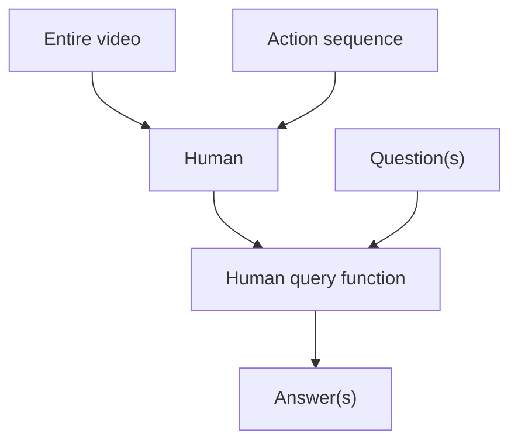

I use this page for visual regression testing, since there's no reason for me to change it over time - unless I'm adding more content to the _end_, which won't affect screenshots taken higher up in the page.

# Header 1

## Header 2

### Header 3

#### Header 4

##### Header 5

###### Header 6

Text

Subtitle: This is a subtitle.

> This is a block quote.
>
> - Block quotes can contain unordered lists
>   - Which are themselves nested
>   - List element
> - Test
>   - Test
>
>  1. Block quotes can also contain ordered lists
>  2. With counters
>      1. That track depth

# Admonitions
>
> [!abstract]

> [!note]
> The content of both the nested and non-nested "note" admonition.

> [!info]

> [!example]

> [!math]

> [!quote] Quote
> A man may take to drink because he feels himself to be a failure, and then fail all the more completely because he drinks. It is rather the same thing that is happening to the English language. It becomes ugly and inaccurate because our thoughts are foolish, but the slovenliness of our language makes it easier for us to have foolish thoughts. The point is that the process is reversible. ^nested
>
> > [!note] This is a nested admonition.
> > The content of both the nested and non-nested "note" admonition.

> [!goose]
> Geese are better than dogs.

> [!idea]

> [!todo]

> [!question]

> [!warning]

> [!failure]

> [!danger]

> [!bug]

> [!thanks]

> [!success]

> [!money]

> [!info]- This collapsible admonition starts off collapsed
> Hidden content.

> [!info]+ This collapsible admonition starts off open
> Displayed content.
>
## Mermaid diagrams



# Figcaptions

```python
a = b + c
```

Code: A `<figcaption>` element created from the Markdown cue of "Code:".


Figure: A `<figcaption>` element created from the Markdown cue of "Figure:".

|    Feature | Light Mode   | Dark Mode     |
| ---------: | :----------- | :------------ |
| Text color | Dark gray    | Light gray    |

Table: A `<figcaption>` element created from the Markdown cue of "Table:".

# Float

# Videos

# Images

# Spoilers
>
>Here be hidden text!
>
>! This text is hidden until you hover over it.
>! Multiple lines can be hidden
>! Like this!

# Math

Inline math: $e^{i\pi} + 1 = 0$

Display math:
$$
\begin{aligned}
f(x) &= x^2 + 2x + 1 \\
&= (x + 1)^2
\end{aligned}
$$

# Link features

## Internal links

Here's a link to [another page](/some-page) with popover preview.

## External links with favicons

Check out [GitHub](https://github.com).

# Typography

## Smallcaps

The <abbr>NATO</abbr> alliance met in the <abbr>USA</abbr>.

## Numbers and units

This computer has 16GB of RAM and runs at 3.2GHz.

## Smart quotes

"This is a quote with 'nested' quotes inside it."

## Fractions and math

This solution is 2/3 water, mixed on 01/01/2024.

## Dropcaps

<span class="dropcap" data-first-letter="T">T</span>his paragraph demonstrates a dropcap.

<center id="the-pond-dropcaps" style="font-size:min(4rem, 15vw);">
<span class="dropcap" data-first-letter="T" style="color: color-mix(in srgb, 55% red, var(--midground-fainter));">T</span>
<span class="dropcap" data-first-letter="H" style="color: color-mix(in srgb, 55% orange, var(--midground-fainter));">H</span>
<span class="dropcap" data-first-letter="E"  style="color: color-mix(in srgb, 65% yellow, var(--midground-fainter));">E</span>
<br/>  
<span class="dropcap" data-first-letter="P"  style="color: color-mix(in srgb, 65% green, var(--midground-fainter));">P</span>
<span class="dropcap" data-first-letter="O"  style="color: color-mix(in srgb, 65% blue, var(--midground-fainter));">O</span>
<span class="dropcap" data-first-letter="N"  style="color: color-mix(in srgb, 65% purple, var(--midground-fainter));">N</span>
<span class="dropcap" data-first-letter="D"  style="color: color-mix(in srgb, 65% pink, var(--midground-fainter));">D</span>
</center>

# Emoji examples

😀 😃 😄 😁 😆 😅 🤣 😂 🙂 🙃 😉 😊 😇 🥰 😍 🤩 😘 😗 ☺ 😚 😙 🥲 😋 😛 😜 🤪 😝 🤑 🤗 🤭 🤫 🤔 🤐 🤨 😐 😑 😶 😏 😒 🙄 😬 🤥 😌 😔 😪 🤤 😴 😷 🤒 🤕 🤢 🤮 🤧 🥵 🥶 🥴 😵 🤯 🤠 🥳 🥸 😎 🤓 🧐 😕 😟 🙁 ☹ 😮 😯 😲 😳 🥺 😦 😧 😨 😰 😥 😢 😭 😱 😖 😣 😞 😓 😩 😫 🥱 😤 😡 😠 🤬 😈 👿 💀 ☠ 💩 🤡 👹 👺 👻 👽 👾 🤖 😺 😸 😹 😻 😼 😽 🙀 😿 😾 💋 👋 🤚 🖐 ✋ 🖖 👌 🤏 ✌ 🤞 🤟 🤘 🤙 👈 👉 👆 🖕 👇 ☝ 👍 👎 ✊ 👊 🤛 🤜 👏 🙌 👐 🤲 🤝 🙏 ✍ 💅 🤳 💪 🦾 🦿 🦵 🦶 👂 🦻 👃 🧠 🦷 🦴 👀 👁 👅 👄

🙈 🙉 🙊 💥 💫 💦 💨 🐵 🐒 🦍 🦧 🐶 🐕 🦮 🐕‍🦺 🐩 🐺 🦊 🦝 🐱 🐈 🐈‍⬛ 🦁 🐯 🐅 🐆 🐴 🐎 🦄 🦓 🦌 🦬 🐮 🐂 🐃 🐄 🐷 🐖 🐗 🐽 🐏 🐑 🐐 🐪 🐫 🦙 🦒 🐘 🦣 🦏 🦛 🐭 🐁 🐀 🐹 🐰 🐇 🐿 🦫 🦔 🦇 🐻 🐻‍❄️ 🐨 🐼 🦥 🦦 🦨 🦘 🦡 🐾 🦃 🐔 🐓 🐣 🐤 🐥 🐦 🐧 🕊 🦅 🦆 🦢 🦉 🦤 🪶 🦩 🦚 🦜 🐸 🐊 🐢 🦎 🐍 🐲 🐉 🦕 🦖 🐳 🐋 🐬 🦭 🐟 🐠 🐡 🦈 🐙 🐚 🐌 🦋 🐛 🐜 🐝 🪲 🐞 🦗 🪳 🕷 🕸 🦂 🦟 🪰 🪱 🦠 💐 🌸 💮 🏵 🌹 🥀 🌺 🌻 🌼 🌷 🌱 🌲 🌳 🌴 🌵 🌾 🌿 ☘ 🍀 🍁 🍂 🍃 🍄 🌰 🦀 🦞 🦐 🦑 🌍 🌎 🌏 🌐 🌑 🌒 🌓 🌔 🌕 🌖 🌗 🌘 🌙 🌚 🌛 🌜 ☀ 🌝 🌞 ⭐ 🌟 🌠 ☁ ⛅ ⛈ 🌤 🌥 🌦 🌧 🌨 🌩 🌪 🌫 🌬 🌈 ☂ ☔ ⚡ ❄ ☃ ⛄ ☄ 🔥 💧 🌊 🎄 ✨ 🎋 🎍

# Footnote demonstration

This text omits a detail.[^footnote] This sentence has multiple footnotes.[^1][^2]

[^1]: First footnote in a row.
[^2]: Second footnote in a row.

[^footnote]: Here's the detail, in a footnote. And here's a nested footnote.[^nested]

[^nested]: I'm a footnote. I'm enjoying my nest! 🪺
