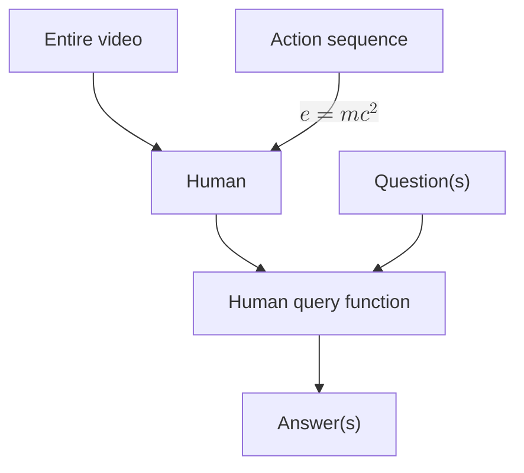

I use this page for [visual regression testing](/design#visual-regression-testing).

# Header 1 (`inline_code`)

## Header 2 (SMALLCAPS)

## 1984: Full-size numbers

### Header 3

#### Header 4

##### Header 5

###### Header 6

Text

Subtitle: This is a subtitle.

> This is a block quote.
>
> - Block quotes can contain unordered lists
>   - Which are themselves nested
>   - List element
> - Test
>   - Test
>
>  1. Block quotes can also contain ordered lists
>  2. With counters
>      1. That track depth

1. A normal ordered list
    1. Indented
        1. Indented
            1. Indented
                1. ...
                    1. ...
2. Test

- Unordered list
    - .
        - .
            - .
                - .
                    - .
                - .
    - The last bullet

# Admonitions
>
> [!abstract]

> [!note]
> The content of both the nested and non-nested "note" admonition.

> [!info]

<!--spellchecker-disable-->
> [!example]
> This word is solongitmightendupoverflowingornotwrappingiftheconfigurationiswrong.
<!--spellchecker-enable-->

> [!math]

> [!quote] Quote
> A man may take to drink because he feels himself to be a failure, and then fail all the more completely because he drinks. It is rather the same thing that is happening to the English language. It becomes ugly and inaccurate because our thoughts are foolish, but the slovenliness of our language makes it easier for us to have foolish thoughts. The point is that the process is reversible. ^nested
>
> > [!note] This is a nested admonition.
> > The content of both the nested and non-nested "note" admonition.

> [!goose]
> Geese are better than dogs.

> [!idea]

> [!todo]

> [!question]

> [!warning]

> [!failure]

> [!danger]

> [!bug]

> [!thanks]

> [!success]

> [!money]

<blockquote id="test-collapse" class="callout info is-collapsible is-collapsed" data-callout="info" data-callout-fold="">
<div class="callout-title"><div class="callout-icon"></div><div class="callout-title-inner">This collapsible admonition starts off collapsed </div><div class="fold-callout-icon"></div></div>
<div class="callout-content"><p>Hidden content.</p></div>
</blockquote>

<blockquote id="test-open" class="callout info is-collapsible" data-callout="info" data-callout-fold="">
<div class="callout-title"><div class="callout-icon"></div><div class="callout-title-inner">This collapsible admonition starts off open </div><div class="fold-callout-icon"></div></div>
<div class="callout-content"><p>Displayed content.</p></div>
</blockquote>

> [!quote] Admonition with tags
> <br/>
> <em>Hi!</em>
>
> Hi
>

> [!quote] Checking that HTML formatting is applied to each paragraph element
> Comes before the single quote
>  
> 'I will take the Ring'
>
# Mermaid diagrams



# Captions

```python
a = b + c
```

Code: A `<figcaption>` element created from the Markdown cue of "Code:".


Figure: A `<figcaption>` element created from the Markdown cue of "Figure:".

|    Feature | Light Mode | Dark Mode  |
| ---------: |  --------- | :--------- |
| Text color | Dark gray  | Light gray |

Table: A `<figcaption>` element created from the Markdown cue of "Table:".

# Media

## Video

<video autoplay muted loop playsinline src="https://assets.turntrout.com/static/images/posts/prune_still-easy_trajectories.mp4" alt="The baseline RL policy makes a big mess while the AUP policy cleanly destroys the red pellets and finishes the level."><source src="https://assets.turntrout.com/static/images/posts/prune_still-easy_trajectories.mp4" type="video/mp4"></video>

## Audio

<center><audio src="https://assets.turntrout.com/static/audio/batman.mp3" controls> </audio></center>

## Transclusion
>
> ![[about#^first-para]]

## Images


Figure: This image should be transparent in light mode and have a light background in dark mode.

## Fatebook embed

<iframe src="https://fatebook.io/embed/q/are-you-going-to-like-turntrout-com---cm2u10nym00029cc3j1h05pot?compact=true&requireSignIn=false" height="200"></iframe>

# Spoilers
>
>Normal blockquote

>! This text is hidden until you hover over it.
>! Multiple lines can be hidden
>! Like this!

# Math

Inline math: $e^{i\pi} + 1 = 0$

Display math:
$$
\begin{aligned}
f(x) &= x^2 + 2x + 1 \\
&= (x + 1)^2
\end{aligned}
$$
Post-math text. The following equations should display properly:

$$\nabla \cdot \mathbf{E}  =\frac{\rho}{\varepsilon_0} \qquad \nabla \cdot \mathbf{B}  =0 \qquad \nabla \times \mathbf{E}  =-\frac{\partial \mathbf{B}}{\partial t} \qquad \nabla \times \mathbf{B}  =\mu_0\left(\mathbf{J}+\varepsilon_0 \frac{\partial \mathbf{E}}{\partial t}\right)$$


# Link features

## Internal links

Here's a link to [another page](/shard-theory) with popover preview. [This same-page link goes to the "smallcaps" section.](#smallcaps)

## External links with favicons

Check out [GitHub](https://github.com). 

# Typography

## Smallcaps

The NATO alliance met in the USA.   <!--spellchecker-disable-->ABCDEFGHIJKLMNOPQRSTUVWXYZ <abbr class="small-caps">fi fl ff ffi ffl fj ft st ct th ck</abbr><!--spellchecker-enable-->

## Numbers and units

This computer has 16GB of RAM and runs at 3.2GHz.

## Smart quotes

"This is a quote with 'nested' quotes inside it."

## Fractions and math

This solution is 2/3 water, mixed on 01/01/2024.

## Ordinal suffixes

He came in 1st but I came in 5,300,251st. :(

## Dropcaps

<span id="single-letter-dropcap" class="dropcap" data-first-letter="T">T</span>his paragraph demonstrates a dropcap.

<center style="font-size:4rem;">
<span class="dropcap" data-first-letter="A" style="margin-right: 5rem;display:inline;"></span>
<span class="dropcap" data-first-letter="" style="color: var(--foreground);">A</span>
<div class="dropcap" data-first-letter="A" style="font-size: 4rem; color: var(--foreground);--before-color:var(--foreground);">A</div>
</center>

<center id="the-pond-dropcaps" style="font-size:min(4rem, 15vw);line-height:1;">
<span class="dropcap" data-first-letter="T" style="--before-color: color-mix(in srgb, 55% red, var(--midground-fainter));">T</span>
<span class="dropcap" data-first-letter="H" style="--before-color: color-mix(in srgb, 55% orange, var(--midground-fainter));">H</span>
<span class="dropcap" data-first-letter="E"  style="--before-color: color-mix(in srgb, 65% yellow, var(--midground-fainter));">E</span>
<br/>  
<span class="dropcap" data-first-letter="P"  style="--before-color: color-mix(in srgb, 65% green, var(--midground-fainter));">P</span>
<span class="dropcap" data-first-letter="O"  style="--before-color: color-mix(in srgb, 65% blue, var(--midground-fainter));">O</span>
<span class="dropcap" data-first-letter="N"  style="--before-color: color-mix(in srgb, 65% purple, var(--midground-fainter));">N</span>
<span class="dropcap" data-first-letter="D"  style="--before-color: color-mix(in srgb, 65% pink, var(--midground-fainter));">D</span>
</center>

# Emoji examples

😀 😃 😄 😁 😆 😅 🤣 😂 🙂 🙃 😉 😊 😇 🥰 😍 🤩 😘 😗 ☺ 😚 😙 🥲 😋 😛 😜 🤪 😝 🤑 🤗 🤭 🤫 🤔 🤐 🤨 😐 😑 😶 😏 😒 🙄 😬 🤥 😌 😔 😪 🤤 😴 😷 🤒 🤕 🤢 🤮 🤧 🥵 🥶 🥴 😵 🤯 🤠 🥳 🥸 😎 🤓 🧐 😕 😟 🙁 ☹ 😮 😯 😲 😳 🥺 😦 😧 😨 😰 😥 😢 😭 😱 😖 😣 😞 😓 😩 😫 🥱 😤 😡 😠 🤬 😈 👿 💀 ☠ 💩 🤡 👹 👺 👻 👽 👾 🤖 😺 😸 😹 😻 😼 😽 🙀 😿 😾 💋 👋 🤚 🖐 ✋ 🖖 👌 🤏 ✌ 🤞 🤟 🤘 🤙 👈 👉 👆 🖕 👇 ☝ 👍 👎 ✊ 👊 🤛 🤜 👏 🙌 👐 🤲 🤝 🙏 ✍ 💅 🤳 💪 🦾 🦿 🦵 🦶 👂 🦻 👃 🧠 🦷 🦴 👀 👁 👅 👄

🙈 🙉 🙊 💥 💫 💦 💨 🐵 🐒 🦍 🦧 🐶 🐕 🦮 🐕‍🦺 🐩 🐺 🦊 🦝 🐱 🐈 🐈‍⬛ 🦁 🐯 🐅 🐆 🐴 🐎 🦄 🦓 🦌 🦬 🐮 🐂 🐃 🐄 🐷 🐖 🐗 🐽 🐏 🐑 🐐 🐪 🐫 🦙 🦒 🐘 🦣 🦏 🦛 🐭 🐁 🐀 🐹 🐰 🐇 🐿 🦫 🦔 🦇 🐻 🐻‍❄️ 🐨 🐼 🦥 🦦 🦨 🦘 🦡 🐾 🦃 🐔 🐓 🐣 🐤 🐥 🐦 🐧 🕊 🦅 🦆 🦢 🦉 🦤 🪶 🦩 🦚 🦜 🐸 🐊 🐢 🦎 🐍 🐲 🐉 🦕 🦖 🐳 🐋 🐬 🦭 🐟 🐠 🐡 🦈 🐙 🐚 🐌 🦋 🐛 🐜 🐝 🪲 🐞 🦗 🪳 🕷 🕸 🦂 🦟 🪰 🪱 🦠 💐 🌸 💮 🏵 🌹 🥀 🌺 🌻 🌼 🌷 🌱 🌲 🌳 🌴 🌵 🌾 🌿 ☘ 🍀 🍁 🍂 🍃 🍄 🌰 🦀 🦞 🦐 🦑 🌍 🌎 🌏 🌐 🌑 🌒 🌓 🌔 🌕 🌖 🌗 🌘 🌙 🌚 🌛 🌜 ☀ 🌝 🌞 ⭐ 🌟 🌠 ☁ ⛅ ⛈ 🌤 🌥 🌦 🌧 🌨 🌩 🌪 🌫 🌬 🌈 ☂ ☔ ⚡ ❄ ☃ ⛄ ☄ 🔥 💧 🌊 🎄 ✨ 🎋 🎍

## Emoji comparison

<figure id="emoji-comparison-figure">
 <div>
    <div class="subfigure">
      
      <figcaption>Apple</figcaption>
    </div>
    <div class="subfigure">
      
      <figcaption>Google</figcaption>
    </div>
    <div class="subfigure">
      
      <figcaption>Microsoft</figcaption>
    </div>
    <div class="subfigure">
      
      <figcaption>Facebook</figcaption>
    </div>
    <div class="subfigure">
      
      <figcaption>Twitter</figcaption>
    </div>
    <div class="subfigure">
      
      <figcaption>WhatsApp</figcaption>
    </div>
    <div class="subfigure">
      
      <figcaption>Samsung</figcaption>
    </div>
    <div class="subfigure">
      
      <figcaption>LG</figcaption>
    </div>
  </div>
</figure>

# Color palette

<figure>
<div style="display: grid; grid-template-columns: repeat(auto-fit, minmax(min(100%, 300px), 1fr)); gap: 1.5rem; margin-bottom: 1rem;">
  <span id="light-demo" class="light-mode" style="border-radius: 5px; padding: 1rem 2rem; border: 2px var(--midground) solid;">
    <center>Light mode</center>
    <div style="display: grid; grid-template-columns: repeat(auto-fit, minmax(70px, 1fr)); gap: 1rem; place-items: center; margin-top: .5rem; margin-bottom: .25rem;">
      <span style="color: red;">Red</span>
      <span style="color: orange;">Orange</span>
      <span style="color: yellow;">Yellow</span>
      <span style="color: green;">Green</span>
      <span style="color: blue;">Blue</span>
      <span style="color: purple;">Purple</span>
    </div>
    <center></center>
  </span>
  <span id="dark-demo" class="dark-mode" style="border-radius: 5px; padding: 1rem 2rem; border: 2px var(--midground) solid;">
    <center>Dark mode</center>
    <div style="display: grid; grid-template-columns: repeat(auto-fit, minmax(70px, 1fr)); gap: 1rem; place-items: center; margin-top: .5rem; margin-bottom: .25rem;">
      <span style="color: red;">Red</span>
      <span style="color: orange;">Orange</span>
      <span style="color: yellow;">Yellow</span>
      <span style="color: green;">Green</span>
      <span style="color: blue;">Blue</span>
      <span style="color: purple;">Purple</span>
    </div>
    <center></center>
  </span>
</div>
<figcaption>The palettes for light and dark mode. In dark mode, I decrease the saturation of image assets.</figcaption>
</figure>

# Footnote demonstration

This text omits a detail.[^footnote] This sentence has multiple footnotes.[^1][^2]

# Code blocks

```json
"lint-staged": {
 "*.{js, jsx, ts, tsx, css, scss, json}": "prettier --write",
 "*.fish": "fish_indent",
 "*.sh": "shfmt -i 2 -w",
 "*.py": [
     "autoflake --in-place",
     "isort",
     "autopep8 --in-place",
     "black"
    ]
}
```

```plaintext
This is a plain code block without a language specified.
```

# Formatting

- Normal
- _Italics_
- __Bold__
- ___Bold italics___
- ~~Strikethrough~~

## Special fonts

Elvish
<!-- spellchecker-disable -->
: <em><span class="elvish" data-content="Ah! like gold fall the leaves in the wind,">hEÁ jyE7\`B\`V j1pE6E j8"\#\`B 8\~M75%5$ =</span></em>
<!-- spellchecker-enable -->

Scrawled handwriting
: <span class="bad-handwriting"><b>TERROR</b></span>

Gold script
: _<span class="gold-script">Tips hat</span>_

Corrupted text
: <span class="corrupted">The corruption creeps ever closer...</span>

[^1]: First footnote in a row.
[^2]: Second footnote in a row.

[^footnote]: Here's the detail, in a footnote. And here's a nested footnote.[^nested]

[^nested]: I'm a nested footnote. I'm enjoying my nest! 🪺
