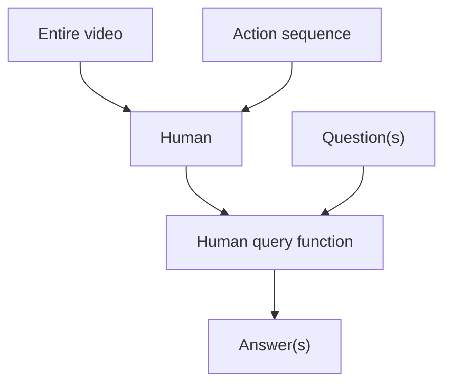
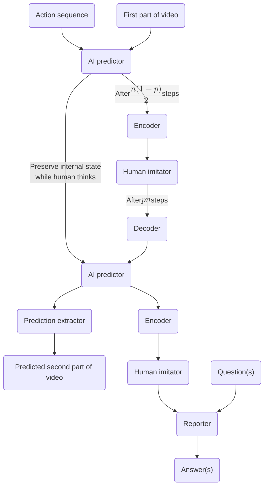

I want to use the AI’s intelligence to figure out how to translate into the human ontology. The hope is to route a smart entity's performance through a dumb entity's understanding and thereby get the smart entity to solve interpretability-by-the-dumb-entity. While my proposed current architecture overcomes a class of counterexamples in a manner which I find elegant, it is still broken by several plausible counterexamples.

# Previously, on ELK

> [!info]
> This section summarizes ELK. Skip to the section [Thinking Via A Human Imitator](#thinking-via-a-human-imitator) if you’re already familiar.

In the mythos of [Eliciting Latent Knowledge](https://docs.google.com/document/d/1WwsnJQstPq91_Yh-Ch2XRL8H_EpsnjrC1dwZXR37PC8/), there exists a forbidden vault locking away an enormous diamond:


In order to fend off thieves, this vault brims with controllable traps and tricks. We've trained a really smart AI to take in a video feed, and consider an action sequence (e.g. "open the trapdoor"), and then predict what the vault camera will show if those actions are taken. Ultimately, we just want to know whether the diamond is safe. Looking at the camera is not always enough:


The AI is really smart. It knows what happened to the diamond. Can we elicit its latent knowledge?

The original ELK document tries to figure out how to train a "reporter" to figure out what's going on in a really smart AI predictor. The intended reporter would _directly translate_ from the AI's ontology to the human’s ontology, and then answer whether the diamond is there or not. In the original ELK document, the reporter is wired as follows:


The training questions/answers are generated by a human considering a range of simple, human-comprehensible situations (represented as `(video, action sequence)` tuples), querying their model of what happened, and answering e.g. whether the diamond is safe or not:



We never want there to be a situation where the AI predictor (the "figure out what's going on" module) _unambiguously knows_ that the diamond was taken, but the reporter says "the diamond is fine." More precisely, we don't want such a configuration to plausibly minimize training loss.

The direct translator minimizes training loss because it answers all questions correctly on the training distribution. So far, so good. However, the _human simulator_ reporter also minimizes training loss, by extracting the predicted video completion from the AI predictor, and then conditioning the human labeler on the entire video and action sequence, and then outputting whatever the human would think about the situation. On the training distribution, this setup gets all of the questions right (and so minimizes training loss), because it exactly reproduces the labeling process! But in general, the human won't understand many situations, and so the human simulator will output answers which the AI predictor knows to be incorrect.

The direct translator solves ELK for narrowly defined questions, like "is the diamond still in the room?". How do we get it?

# Thinking Via A Human Imitator

I want to structure the problem so that direct translation is _instrumentally required_ for minimizing predictive training loss. To that end: What if the AI had to do some proportion $p$  of its thinking in the human net?

<hr/>

Assume that both the AI and the human reason using Bayes nets.[^1] Suppose we have access to a perfect simulation[^2] of not only _a_ human Bayes net, but of _the_ human who labels the training data.

The AI receives the first part of a video and a sequence of actions. Suppose the AI can think for $n$ time steps in total, before it has to predict the remainder of the video. At timestep $(1-p) n/2$, the AI encodes its cognitive work into the human imitator net, where the human’s inference algorithm runs for another $p\cdot n$ steps. Lastly, the AI decodes the human’s state of mind and thinks for the remaining time. For example: If _p_ is 1/3, then the AI thinks for $\frac{n}{3}$ steps, the human thinks for $\frac{n}{3}$  steps, and then the AI thinks for $\frac{n}{3}$ steps.

In order to answer questions, after the last time step, the encoder maps the predictor net’s internal state onto the human net, where the reporter then answers questions. This is illustrated in the diagram below.



<figcaption>The human imitator net is frozen. Everything else is learned concurrently. The “AI predictor”, “encoder”, and “human imitator” modules are the same entities, shown duplicated in order to clarify the computational graph of a forward pass.</figcaption>

## Training procedure

$$
\begin{aligned} & \textbf{Algorithm: Agent Architecture Training} \\ & \textbf{Input: } \text{Dataset labeled by human} \\ & \textbf{Output: } \text{Trained agent architecture} \\ & \\ & 1: \text{Initialize agent architecture, freezing human imitator network} \\ & 2: \textbf{for each} \text{ ((video-1, action sequence, video-2), (q, a)) pair } \textbf{do} \\ & 3: \qquad \text{Provide (video-1, action sequence, question) as input} \\ & 4: \qquad \text{Train network to predict video-2 and the correct answer} \\ & 5: \qquad \text{Hand off inference on the specified schedule} \\ & 6: \textbf{end for} \end{aligned}
$$

## Desired outcome

- The intended (or “faithful”) encoder finds an extremely good (or even the best) mapping from the AI’s ontology to the human’s.
- The intended decoder[^3] efficiently incorporates the human’s cognitive work back into the AI predictor’s cognitive state.
- The intended reporter mimics the human’s query function.

**Why the intended network defeats counterexamples.** Suppose that at its final step of inference, the predictor believes that the diamond has been stolen. If ELK is possible to solve in this instance, there exists a direct translator which reports this fact via translation into the human ontology, and an AI → human ontology map would exist. The intended encoder implements that map and encodes this fact into the imitated human network. The intended reporter implements the human’s query function and reports that the diamond has been stolen.

Therefore, (narrow) ELK reduces to finding the intended encoder and reporter, as described in the bullet points above. Now let’s examine how hard the reduced problem is.

## Learning the reporter

I first want to argue that _if_ the intended encoder is assumed to have been learned, we also learn the intended reporter.[^4] To understand what reporters will be incentivized, let’s reconsider the causal history of the human-provided labels:


The human query function is just the pink box in the following:


That is, the human query function takes in a question, which determines the subset of the net which it considers, and then computes an answer as a function of that subset. For generality, the query function can take different questions as inputs, like “did anyone open the door?”, and then answer by using a different part of the human Bayes net.

The human-provided data points necessarily portray situations that the human basically understands. Therefore, since we assumed the encoder is faithful and the predictor is powerful enough to figure out the second half of the video: on each training example, the simulated and real human end up in _similar states of mind after doing inference_. Just compare the AI’s diagram with the human’s diagram, in order to see that on the training distribution and given a faithful encoder, the after-AI prediction-finishes human imitator should be reasoning _extremely similarly_ to the human. All that’s left to learn is the human query function! Hopefully, this is a simple “blank” for the AI to fill in.

For example, suppose the real human knows that the action sequence opens the trapdoor, and that the video shows someone falling into it. Because the predictor understands the situation and we have the intended encoder, the imitated human also knows this, and perhaps they also know some additional translated details. Therefore, to produce the correct answer, the reporter just has to look at the imitated human’s net and pick out the relevant nodes for the real human’s query function. This is the prototypical human-understandable training example.

The reporter could instead minimize training loss by learning _another_ human simulator which independently does inference after backing out `(video-1, action sequence, video-2)` from the imitated human net, but without having the second human simulator’s intermediate nodes filled in by the encoder. But assuming a faithful encoder, that seems rather ridiculous and easily handled via time or complexity regularization.[^5]

I think there may be a strong story for why a faithful encoder ensures that the learned reporter will be faithful. Contrast this situation to that in the ELK report, where we’re constantly fighting to stop the reporter from being a human simulator. Here, we’re trying to learn a _much simpler reporter_. Therefore, I’m more optimistic about asking questions for which only the intended reporter is the answer.

## Learning the decoder

I’m not worried about the decoder, except insofar as it encourages or discourages faithful encoders. Given the intended encoder, a competent decoder is learned to reduce predictive loss.

## Learning the encoder

Figuring out how to learn the intended encoder would be a big deal. We would know how to force arbitrarily smart agents to solve interpretability on themselves as an instrumental subgoal for their prediction task.

## Candidate counterexamples

Here are a range of attempted counterexamples. First, I claim that the intended setup has lower training loss than the naive human simulator.

**Candidate counterexample:** Suppose the encoder reads `(video-1, actions, predicted video-2)` from the AI predictor module, and then simulates the human overseer doing inference from those observations, and then somehow forces the human imitator net to believe what the human would believe about the diamond, after reasoning from those inputs. Tautologically, this minimizes training loss for the questions.

**Rebuttal:** This reduces the predictive accuracy of the whole AI system, since $pn$ of the AI’s total inference time is wasted.[^6] The intended network leverages at least some useful computation by the human to improve the AI’s predictions, while also acing all of the questions on the training distribution (assuming zero labeling error).

---

**Candidate counterexample:** The AI predictor wipes its internal state at the last moment, except for its intended prediction.

**Rebuttal:** This can’t minimize loss, since the AI predicts slightly less well than an AI which spent _all_ of its available time thinking.

---

**Candidate counterexample:** The encoder implements a meaningful translation midway through the computation, but checks to see if the AI predictor is done thinking, and if so, simulates a human instead.

**Rebuttal:** Randomly select both $p$ and the time when the AI predictor must hand off thinking to the human net. This way, the encoder shouldn’t be able to distinguish between encoding-to-think and encoding-to-report.

---

**Candidate counterexample:** For each training data point, the encoder runs a human simulator, sets the human’s initial beliefs to correctly answer the question if _immediately_ queried by the reporter, but without faithfully encoding the AI’s understanding into the human’s beliefs. Then, if the human net keeps thinking, that means the reporter isn’t being called, and somehow the human’s beliefs evolve in a way which will help the AI predictor once the human’s final beliefs are decoded, without those beliefs meaningfully corresponding to the real situation.

**Rebuttal:** During training, run the human net for $pn$ steps before calling the reporter. Given that we also randomize $p$, this incentivizes the encoder to ensure the human net answers correctly—even if the human net thinks for varying amounts of time before the reporter is called.[^7] (Therefore, during deployment, the reporter can query the human net immediately.)

---

The above counterexample attempts suggest that during training, we should eliminate observable differences between encoding-to-think and encoding-to-report. Therefore, I think we should modify the simplified hand-off procedure I described above so that, during training:

- A range of handoff thresholds and $p$ proportions are drawn—in particular, there should be a reasonable probability of drawing $p$ values close to 0, close to 1, and also 0 and 1 exactly.
- The human net runs for $pn$ steps before calling the reporter.

---

**Candidate counterexample**:

```pseudocode
IF human can understand the situation without direct translation:                      
 translate accurately
ELSE: 
 don't
```

Code: Thanks to `janus` for this counterexample encoder.

**Rebuttal:** This encoder essentially checks whether it’s on the training distribution or not, since we assume we only train on human-comprehensible situations. This encoder seems like an implausible thing to learn, but perhaps it’s considered a plausible counterexample in the ELK game.

---

**Definite counterexample (h/t Evan Hubinger):** Instead of directly translating the state of the room to the human net, an unfaithful encoder computes what imaginary additional cameras would show, given the AI’s best understanding. This unfaithful encoder basically communicates a telepathic vision to the human net, via several simulated video feeds. In fact, the encoder is truthful about what the sensors would show, if they were there. On the training distribution, the rendered videos give the human net an accurate picture of the AI’s best situational understanding. Therefore, the human compute time should be about as predictively helpful as the direct translator’s compute time.

However, there exist situations off of the training distribution where the imaginary sensors are fooled, and so ELK generalization fails. In such cases, the AI predictor knows that there's no diamond, but the unfaithful encoder doesn't communicate that.

**Analysis:** I think that there should be some way besides direct translation to better leverage the human net’s compute, and this seems like a plausible grounding of how it might happen. Unless this is somehow ruled out, I think this counts as a counterexample: There will be situations not in the training distribution, in which the AI predictor knows that the diamond is missing, but where the imaginary sensors are being fooled. However, this bad encoder does not tell the human that the diamond is missing, and so the reporter wrongly answers that the diamond is still present.

<hr/>

Here are some issues I want more clarity on:

- Perhaps it’s better for the encoder to unfaithfully translate so as to help the human net better consume compute, so as to better help the AI predictor use the human net’s inference time.
  - The unfaithful encoding has to pass the questions on the training distribution, which seems to require a bad/non-intended reporter.

- If we already have an unfaithful encoder, the intended reporter may get questions wrong, which might encourage the reporter to be a human simulator (even overcoming regularization).
  - Since the encoder is bad, the reporter is bad; since the reporter is bad, the encoder stays bad. Is this a plausible local minimum?
  - This also requires learning a bad encoder to begin with.

- The costs of direct translation probably grow with the sophistication of the AI predictor, but the costs of human simulation are fixed. Therefore, it might be a better use of the encoder’s compute to simulate the human, fix the right answers in the human net, while also using most of its encoder-compute to keep making progress on the prediction task. The encoder’s work would be stored in the rest of the human net’s nodes, which serves as a latent space for the decoder. (_h/t Leo Gao_)
  - Note that as $n\to\infty$, there's increasing benefit to using the frozen human net.

- The AI predictor might only translate human-comprehensible aspects of the situation, factoring the cognitive work so that the human net thinks about the parts of the situation for which they have a comparative advantage.  
  - Note that the training distribution only contains human-comprehensible situations.
  - Also, the human net might make bad inferences sometimes.
    - If it’s due to systemic bias, the decoder could simply adjust the human net’s outputs when incorporating their conclusions back into the predictor net. This means that the encoder can still be faithful.
    - However, the human net may need to be “lied to” by the encoder in a way which is not just simplification via direct translation, but encoding-level distortion so that the human’s decoded cognitive work is more helpful for prediction.
    - We might mitigate this by doing perfect inference in the human net.
      - But this would make the approach less likely to transfer when the human cognition isn’t neatly represented in a Bayesian network.

- Depending on how we balance loss between prediction and question-answering, and the expressiveness of the AI network, loss-minimizing configurations may be chosen from a nontrivial Pareto frontier of (total predictive loss, total Q/A loss), which might change the analysis.
- Does the scheme definitely break if the simulated human is stupid (e.g. –2SD intelligence)? If so, that’s a bad sign, as it’s unlikely that the approach just _happens_ to start robustly working somewhere in between stupid and smart human intelligence levels.

## Competitiveness

I think that this setup allows predictive accuracy which is competitive with the unaligned benchmark—even more so once training is over.

**Training distribution.** At worst, the AI can just ignore the decoder output, and so the AI isn’t any worse at prediction than if it only had $1-p$ times its original thinking time.

**Deployment.** After training is complete, we don’t actually have to make the AI consult the human net at all; we can set $p=0$\. This should work fine if we train the network with a range of $p$ values and handoff thresholds, so that it’s used to reasoning on its own, to reasoning mostly via the human, to everywhere in between; at any time, the encoder should be ready to read out the predictor module’s state to the human.

While the AI might be used to “working with” the human net, the predictor presumably consumes compute more efficiently than does the encoder/human net/decoder ensemble, and so the runtime compute budget is likely best used by the AI predictor. Once the predictor has finished inference, we can just encode the final state into the human net, where the reporter answers questions about the situation.

One way in which the intended network could suffer a performance penalty is, the AI predictor learns to make its cognition more easily human-interpretable (so as to make the encoding/decoding easier), which somewhat restricts its predictive capabilities. This issue is not fixed by setting $p=0$ at runtime. I’m not sure how big of a deal this is.

# Conclusion

I feel excited about this proposal. It seems to at least defeat the naive human simulator in an interesting way, but e.g. Evan’s counterexample shows that it still fails in the worst case. That is, there are many ways to extract useful compute from the human net, and we already know of one which is not direct translation. I probably need a significantly better design to exclude all of the ways which are not direct translation—if that’s even possible at all. I think it’s likely (90%) that a simple counterexample-free design simply doesn’t exist.

I wonder whether there are basic design improvements which cleanly resolve many of the remaining issues.

> [!thanks]
>Thanks to `AI_WAIFU`, `janus`, Evan Hubinger, Mark Xu, Leo Gao, Justis Mills, and Rohin Shah for feedback.

[^1]: This proposal only seems to require that both agents reason in a way where “amount of time thinking” is a sensible parameter.

[^2]: Perfect imitation is a simplifying assumption which may not be realistic, but whose presence does not make ELK obviously trivial. I think that if this approach works given the assumption, we can probably relax it.

[^3]: The decoder affects the AI’s predictive capabilities during training; it is logically unrelated to whether the system solves ELK, or to its capabilities during deployment. Practically, absent a good decoder, there is little reason for a faithful encoder to be learned.

[^4]: Even if this holds, however, we will still have to reason about whether the two components can be jointly learned, or if the intended encoder can be learned before the reporter. Let’s set that aside for now.

[^5]: We avoid [the pitfalls of regularizing the ELK-reporter](https://docs.google.com/document/d/1WwsnJQstPq91_Yh-Ch2XRL8H_EpsnjrC1dwZXR37PC8/edit#heading=h.b93ykmpkp55y) because our intended reporter doesn’t have to translate from the superhuman predictor, it just has to deal with the constant-size frozen human imitator network.

[^6]: This logic fails if the AI predictor can get pixel-perfect video prediction on the training distribution, even without using the human’s portion of the time budget. However, this is presumably dealt with by having some chance of _p_ being close to 1—so that the human net has to do most of the information processing.

[^7]: This probably rules out a class of “fragile” encodings which don’t make sense upon human reflection, which might push towards more faithful and robust encoders.
