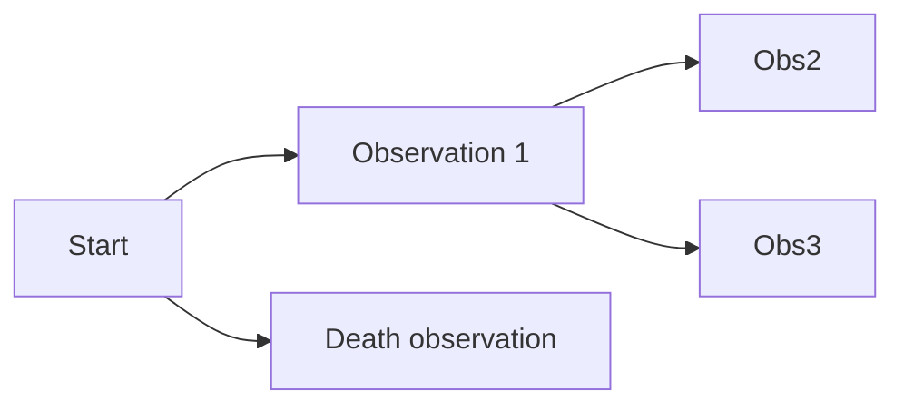

---

> [!note] Summary of the current power-seeking theorems
> Give me a utility function, any utility function, and for most ways I could jumble it up—most ways I could permute which outcomes get which utility, for most of these permutations, the agent will seek power.

This kind of argument assumes that the set \{utility functions we might specify\} is closed under permutation. This is unrealistic. Practically speaking, we reward agents based off of observed features of the agent's environment.

For example, Pac-Man eats dots and gains points. A football AI scores a touchdown and gains points. A robot hand [solves a Rubik's cube and gains points](https://arxiv.org/pdf/1910.07113.pdf). But most _permutations_ of these objectives are implausible because they're high-entropy, they're complex, they assign high reward to one state and low reward to another state without a simple generating rule that grounds out in observed features. Practical objective specification doesn't allow that many degrees of freedom in what states get what reward.

I explore how instrumental convergence works in this case. I also walk through how these new results retrodict the fact that [instrumental convergence basically disappears for agents with utility functions over action-observation histories](/power-seeking-beyond-MDPs).

# Case Studies

## Gridworld

Consider the following environment, where the agent can either stay put or move along a purple arrow.

{style="width:85%;"}

Figure: From left to right, top to bottom, the states have labels $s_\triangle, s_\bigcirc,s_\text{left},s_\text{start},s_\text{right},s_\bigstar.$

Suppose the agent gets some amount of reward each timestep, and it's choosing a policy to maximize its average per-timestep reward. [Previous results](https://proceedings.neurips.cc/paper/2021/hash/c26820b8a4c1b3c2aa868d6d57e14a79-Abstract.html) tell us that for generic reward functions over states, at least half of them incentivize going right. There are two terminal states on the left, and three on the right, and 3 > 2; we conclude that at least $\frac{\text{floor(3/2)}}{\text{floor(3/2)}+1}=\frac{1}{2}$ [of objectives incentivize going right](/quantitative-strength-of-instrumental-convergence).

It's damn hard to have so many degrees of freedom that you're specifying a potentially independent utility number for each state.[^1] Meaningful utility functions will be featurized in some sense—only depending on certain features of the world state, and of how the outcomes transpired, etc. If the featurization is linear, then it's particularly easy to reason about power-seeking incentives.

### Shape featurization

Let $\text{feat}(s)$ be the feature vector for state $s$, where the first entry is 1 iff the agent is standing on $\triangle$. The second and third entries represent $\bigcirc$ and $\bigstar$, respectively. That is, the featurization only records what shape the agent is standing on. Suppose the agent makes decisions [in a way which depends only on](/satisficers-tend-to-seek-power#and-that-s-all) the featurized reward of a state: $R(s)=\text{feat}(s)^\top \mathbf{\alpha}$, where $\mathbf{\alpha}\in\mathbb{R}^3$ expresses the feature coefficients. Then the relevant terminal states are only \{triangle, circle, star\}, and we conclude that 2/3 of coefficient vectors incentivize going right. This is true more precisely in the orbit sense: For every coefficient vector $\alpha$, at least[^2] 2/3 of its permuted variants make the agent prefer to go right.

This particular featurization **increases** the strength of the orbit-level incentives—whereas before, we could only guarantee 1/2\-strength power-seeking tendency, now we guarantee 2/3\-level.[^3][^4]

There's another point I want to make in this tiny environment.

{style="width:85%;"}
 Figure: From left to right, top to bottom, the states have labels $s_\triangle, s_\bigcirc,s_\text{left},s_\text{start},s_\text{right},s_\bigstar.$

Suppose we find an environmental symmetry $\phi$ which lets us apply the [original power-seeking theorems](https://proceedings.neurips.cc/paper/2021/hash/c26820b8a4c1b3c2aa868d6d57e14a79-Abstract.html) to raw reward functions over the world state. Letting $\mathbf{e}_s\in \mathbb{R}^6$ be a column vector with an entry of 1 at state $s$ and 0 elsewhere, in this environment, we have the symmetry enforced by

$$
\phi\cdot\overset{\text{State distributions, left}}{\left\{\mathbf{e}_{\triangle}, \mathbf{e}_\text{left}\right\}} =\left\{\mathbf{e}_{\bigcirc}, \mathbf{e}_\text{right}\right\}\subsetneq \overset{\text{State distributions, right}}{\left\{\mathbf{e}_{\bigcirc}, \mathbf{e}_\text{right}, \mathbf{e}_\bigstar \right\}}.
$$

Given a state featurization, and given that we know that there's a state-level environmental symmetry $\phi$, when can we conclude that there's also feature-level power-seeking in the environment?

Here, we're asking "if reward is only allowed to depend on how often the agent visits each shape, and we know that there's a raw state-level symmetry, when do we know that there's a shape-feature embedding from (left shape feature vectors) into (right shape feature vectors)?"

In terms of "what choice lets me access 'more' features?", this environment is relatively easy—look, there are twice as many shapes on the right. More formally, we have:

$$
\overset{\text{Feature vectors on the left}}{\left\{\begin{pmatrix}1\triangle\\ 0\bigcirc \\ 0 \bigstar\end{pmatrix}, \begin{pmatrix}0\triangle\\ 0\bigcirc \\ 0 \bigstar\end{pmatrix}\right\}} \qquad \overset{\text{Feature vectors on the right}}{\left\{\begin{pmatrix}0\triangle\\ 1\bigcirc \\ 0 \bigstar\end{pmatrix}, \begin{pmatrix}0\triangle\\ 0\bigcirc \\ 0 \bigstar\end{pmatrix}, \begin{pmatrix}0\triangle\\ 0\bigcirc \\ 1 \bigstar\end{pmatrix}\right\}},
$$

where the left set can be permuted two separate ways into the right set (since the zero vector isn't affected by feature permutations).

I'm gonna play dumb and walk through to illustrate a more important point about how power-seeking tendencies are guaranteed when featurizations respect the structure of the environment.

Consider the state $s_\triangle$. We permute it to be $s_\bigcirc$ using $\phi$ (because $\phi(s_\triangle)=s_\bigcirc$), and then featurize it to get a feature vector with 1$\bigcirc$ and 0 elsewhere.

Alternatively, suppose we first featurize $s_\triangle$ to get a feature vector with 1$\triangle$ and 0 elsewhere. Then we swap which features are which, by switching $\triangle$ and $\bigcirc$. Then we get a feature vector with 1$\bigcirc$ and 0 elsewhere—the same result as above.

The shape featurization plays nice with the actual nitty-gritty environment-level symmetry. More precisely, a sufficient condition for feature-level symmetries: (Featurizing and then swapping which features are which) commutes with (swapping which states are which and then featurizing).[^5] And where there are feature-level symmetries, just apply the normal power-seeking theorems to conclude that there are decision-making tendencies to choose sets of larger features.

### $(x,y)$ featurization

In a different featurization, suppose the featurization is the agent's $x/y$ coordinates. $R(s_{x,y}) = \alpha_1 x + \alpha_2 y$.

{style="width:85%;"}

Given the **start** state, if the agent goes _up_, its reachable feature vector is just $(x=0, y=1)$, whereas the agent can induce $(x=1, y=0)$ if it goes _right_. Therefore, whenever _up_ is strictly optimal for a featurized reward function, we can permute that reward function's feature weights by swapping the $x$- and $y$-coefficients ($\alpha_1$ and $\alpha_2$, respectively). Again, this new reward function is featurized, and it makes going _right_ strictly optimal. So the usual arguments ensure that at least half of these featurized reward functions make it optimal to go right.

Sometimes, these similarities won't hold, even when it initially looks like they "should"!

{style="width:85%;"}

| Action | Feature vectors available                                                                            |
| ----: | :--------------------------------------------------------------------------------------------------- |
|  Left  | $\left \{ \begin{pmatrix}x: -1\\ y:0\end{pmatrix}, \begin{pmatrix}x:-1\\  y:-1\end{pmatrix}\right\}$ |
| Right  | $\left \{ \begin{pmatrix}x: 1\\ y:0\end{pmatrix}, \begin{pmatrix}x:1\\ y:1\end{pmatrix}\right\}$     |

Switching feature labels cannot copy the _left_ feature set into the _right_ feature set! There's no way to just apply a feature permutation to the _left_ set, and thereby produce a subset of the _right_ feature set. Therefore, the theorems don't apply, and so they don't guarantee anything about how most permutations of every reward function incentivize some kind of behavior.

On reflection, this makes sense. If $\alpha_1=\alpha_2=-1$, then there's no way the agent will want to go _right._ Instead, it'll go for the negative feature values offered by going _left_. This will hold for _all_ permutations of this feature labelling, too. So the orbit-level incentives _can't_ hold.

If the agent can be made to "hate everything" (all feature weights $\alpha_i$ are negative), then it will pursue opportunities which give it negative-valued feature vectors, or at least strive for the oblivion of the zero feature vector. Vice versa for if it positively values all features.

## StarCraft II

Consider a deep RL training process where the agent's episodic reward is featurized into a weighted sum of the different resources the agent has at the end of the game, with weight vector $\alpha$. For simplicity, we fix an opponent policy and a learning regime (number of epochs, learning rate, hyperparameters, network architecture, and so on). We consider the effects of varying the reward feature coefficients $\alpha$.

---

Outcomes of interest
: Game state trajectories.

AI decision-making function
: $f(T \mid \alpha)$ returns the probability that, given our fixed learning regime and reward feature vector $\alpha$, the training process produces a policy network whose rollouts instantiate some trajectory $\tau \in T$.

What the theorems say
: If $\alpha$ is the zero vector, the agent gets the same reward for all trajectories, and so gradient descent does nothing, and the randomly initialized policy network quickly loses against any reasonable opponent. No power-seeking tendencies if this is the only plausible parameter setting.
: If $\alpha$ only has negative entries, then the policy network quickly learns to throw away all of its resources and not collect any more. If and only if this has been achieved, the training process is indifferent to whether the game is lost. No real power-seeking tendencies if it's only plausible that we specify a negative vector.
: If $\alpha$ has a positive entry, then policies learn to gather as much of that resource as possible. In particular, there _aren't_ orbit elements $\alpha$ with positive entries but where the learned policy tends to just die, and so we don't even have to check that the permuted variants $\phi\cdot \alpha$ of such feature vectors are also plausible. Power-seeking occurs.
: This reasoning _depends on which kinds of feature weights are plausible_, and so wouldn't have been covered by the previous results.

## Minecraft

Similar setup to StarCraft II, but now the agent's episode reward is $\alpha_1 \cdot$(Amount of iron ore in chests within 100 blocks of spawn after 2 in-game days)$+\alpha_2\cdot$(Same but for coal), where $\alpha_1,\alpha_2\in \mathbb{R}$ are scalars (together, they form the coefficient vector $\alpha\in \mathbb{R}^2$).

Figure: An iron ore block in Minecraft.

Outcomes of interest
: Game state trajectories.

AI decision-making function
: $f(T \mid \alpha)$ returns the probability that, given our fixed learning regime and feature coefficients $\alpha$, the training process produces a policy network whose rollouts instantiate some trajectory $\tau \in T$.

What the theorems say
: If $\alpha$ is the zero vector, the analysis is the same as before. No power-seeking tendencies. In fact, the agent tends to _not_ gain power because it has no optimization pressure steering it towards the few action sequences which gain the agent power.
: If $\alpha$ only has negative entries, the agent definitely doesn't hoard resources in chests. Otherwise, there's no real reward signal and gradient descent doesn't do a whole lot due to sparsity.
: If $\alpha$ has a positive entry, and if the learning process is good enough, agents tend to stay alive. If the learning process is good enough, there just won't be a single feature vector with a positive entry which tends to produce non-self-empowering policies.

The analysis so far is nice to make a bit more formally, but it isn't really pointing out anything that we couldn't have figured out pre-theoretically. I think I can sketch out more novel reasoning, but I'll leave that to a future post.

# Beyond The Featurized Case

Consider some arbitrary set $\mathfrak{D}\subseteq \mathbb{R}^d$ of "plausible" utility functions over $d$ outcomes. If we have the usual big set $B$ of outcome lotteries (which possibilities are, in the view of this theory, often attained via "power-seeking"), and $B$ contains $n$ copies of some smaller set $A$ via environmental symmetries $\phi_1,\ldots, \phi_n$, then when are there orbit-level incentives _within_ $\mathfrak{D}$—when will most reasonable variants of utility functions make the agent more likely to select $B$ rather than $A$?

When the environmental symmetries can be applied to the $A$\-preferring-variants, in a way which produces another plausible objective. Slightly more formally, if, for every plausible utility function $u\in \mathfrak{D}$ where the agent has a greater chance of selecting $A$ than of selecting $B$, we have the membership $\phi_i \cdot u \in \mathfrak{D}$ for all $i=1,...,n$.

This covers the totally general case of arbitrary sets of utility function classes we might use. (And, technically, "utility function" is decorative at this point—it just stands in for a parameter which we use to retarget the AI policy-production process.)

The general result highlights how $\mathfrak{D} := \{ \text{plausible objective functions}\}$ affects what conclusions we can draw about orbit-level incentives. All else equal, being able to specify more plausible objective functions for which $f(B \mid u) \geq f(A \mid u)$ means that we're more likely to ensure closure under certain permutations. Similarly, adding plausible $A$\-dispreferring objectives makes it harder to satisfy $f(B \mid u) < f(A \mid u) \implies \phi_i\cdot u \in \mathfrak{D}$, which makes it harder to ensure closure under certain permutations, which makes it harder to prove instrumental convergence.

# Revisiting How The Environment Structure Affects Power-Seeking Incentive Strength

> [!quote] [Seeking Power is Convergently Instrumental in a Broad Class of Environments](/power-seeking-beyond-MDPs)
> Structural assumptions on utility really do matter when it comes to instrumental convergence:
>
> |                                                  Setting | Strength of instrumental convergence                                                                                                  |
> | -------------------------------------------------------: | :------------------------------------------------------------------------------------------------------------------------------------ |
> |                                          uAOH | [Nonexistent](/power-seeking-beyond-MDPs#Instrumental-Convergence-Disappears-For-Utility-Functions-Over-Action-Observation-Histories) |
> |                                           uOH | [Strong](/power-seeking-beyond-MDPs#formal-justification)                                                                             |
> | State-based objectives (e.g. state-based reward in MDPs) | [Moderate](/quantitative-strength-of-instrumental-convergence)                                                                        |
>
> [Environmental structure can cause instrumental convergence](/environmental-structure-can-cause-instrumental-convergence), but (the absence of) structural assumptions on utility can make instrumental convergence go away (for optimal agents).

In particular, for the MDP case, I wrote:

> MDPs assume that utility functions have a lot of structure: the utility of a history is time-discounted additive over observations. Basically, $u(a_1 o_1 a_2 o_2\ldots) = \sum_{t=1}^\infty \gamma^{t-1}R(o_t)$, for some $\gamma\in[0,1)$ and reward function $R:\mathcal{O}\to\mathbb{R}$ over observations. And because of this structure, the agent's average per-timestep reward is controlled by the last observation it sees. There are exponentially fewer last observations than there are _observation histories._ Therefore, in this situation, instrumental convergence is exponentially weaker for reward functions than for arbitrary uOH.

This involves a featurization which takes in an action-observation history, ignores the actions, and spits out time-discounted observation counts. The utility function is then over observations (which are just states in the MDP case). Here, the symmetries can only be over states, and not histories, and no matter how expressive the plausible state-based-reward-set $\mathfrak{D}_S$ is, it can't compete with the exponentially larger domain of the observation-history-based-utility-set $\mathfrak{D}_{OH}$, and so the featurization has _limited how strong instrumental convergence can get_ by projecting the high-dimensional uOH into the lower-dimensional uState.

However, when we go from uAOH to uOH, we're throwing away even more information—information about the actions! This is also a sparse projection. So what's up?

When we throw away info about actions, we're breaking some symmetries which made instrumental convergence disappear in the uAOH case. In any deterministic environment, there are equally many uAOH which make me want to go e.g. down (and, say, die) as which make me want to go up (and survive). This is guaranteed by symmetries which swap the value of an optimal AOH with the value of an AOH going the other way:

Figure: If the agent cares not about its own action histories, but about its observation histories, there are just more ways to care about going _up_ and being alive! Twice as many ways, in fact!

When we restrict the utility function to not care about actions, now you can only modify how it cares about observation histories. Here, the AOH environmental symmetry $\phi_{AOH}$ which previously ensured balanced statistical incentives, no longer enjoys closure under $\mathfrak{D}_{OH}.$ The restricted plausible set theorem no longer works. Thus, instrumental convergence appears when restricting from uAOH to uOH.

> [!thanks]
> I thank Justis Mills for feedback on a draft.

## Appendix: tracking key limitations of the power-seeking theorems

From [last time](/satisficers-tend-to-seek-power):

> [!quote]
>
> 1. The results aren't first-person: They don't deal with the agent's uncertainty about what environment it's in.
> 2. Not all environments have the right symmetries
>     - But most ones we think about seem to
> 3. ~Don't account for the ways in which we might practically express reward functions.~ (This limitation was handled by this post.)

I think it's reasonably clear how to apply the results to realistic objective functions. I also think our objective specification procedures are quite expressive, and so the closure condition will hold and the results go through in the appropriate situations.

[^1]: It's not hard to have this many degrees of freedom in such a small toy environment, but the toy environment is pedagogical. It's practically impossible to have full degrees of freedom in an environment with a trillion states.
[^2]: "At least", and not "exactly." If $\alpha$ is a constant feature vector, it's optimal to go right for every permutation of $\alpha$ (trivially so, since $\alpha$'s orbit has a single element—itself).
[^3]: Even under my more aggressive conjecture about "fractional terminal state copy containment", the unfeaturized situation would only guarantee 3/5\-strength orbit incentives, strictly weaker than 2/3\-strength.
[^4]: Certain trivial featurizations can decrease the strength of power-seeking tendencies, too. For example, suppose the featurization is 2-dimensional:

    $$\begin{pmatrix}\text{1 if the agent is dead, 0 otherwise}\\ \text{1 if the agent is alive, 0 otherwise}\end{pmatrix}.$$  

    This featurization will tend to produce 1:1 survive/die orbit-level incentives. The incentives for raw reward functions [may be 1,000:1 or stronger](/quantitative-strength-of-instrumental-convergence).
[^5]:
    There's something abstraction-adjacent about this result (proposition D.1 in [the linked Overleaf paper](https://www.overleaf.com/read/kmjjqwdfhkvy)). The result says something like "do the grooves of the agent's world model featurization, respect the grooves of symmetries in the structure of the agent's environment?", and if they do, _bam_, sufficient condition for power-seeking under the featurized model. I think there's something important here about how good world-model-featurizations should work, but I'm not sure what that is yet.

    I do know that "the featurization should commute with the environmental symmetry" is something I'd thought—in basically those words—no fewer than 3 times, as early as summer2021, without explicitly knowing what that should even _mean_.
