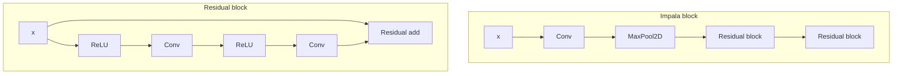
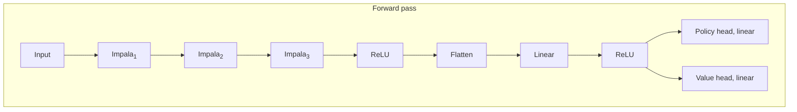

How do agents work, internally? My shard theory [MATS 3.0](https://www.serimats.org/) team set out to do mechanistic interpretability on one of the [goal misgeneralization](https://arxiv.org/abs/2105.14111) agents: the cheese-maze network.

<video autoplay loop muted playsinline><source src="https://assets.turntrout.com/static/images/posts/xuq1yzfdjztdhi4gy0jw.mp4" type="video/mp4; codecs=hvc1">
<source src="https://assets.turntrout.com/static/images/posts/xuq1yzfdjztdhi4gy0jw.webm" type="video/webm"></video>

Figure: The network in action on its training distribution, where cheese is randomly spawned in the top-right 5x5 available grid region. For more training videos, see the [`rand_region_5`](https://drive.google.com/drive/folders/1oX-PoNbqMQKYAPQQMRUSw0bVsaJO9FpP?usp=share_link) Google Drive folder.

We just finished phase 1 of our behavioral and interpretability experiments. Throughout the project, we individually booked predictions -- so as to reduce self-delusion from hindsight bias, to notice where we really could tell ahead of time what was going to happen, and to notice where we really were surprised.

So (especially if you're the kind of person who might later want to say "I knew this would happen" 😉), here's your chance to enjoy the same benefits, before you get spoiled by our upcoming posts.

I don’t believe that someone who makes a wrong prediction should be seen as “worse” than someone who didn’t bother to predict at all, and so answering these questions _at all_ will earn you an increment of my respect. :) Preregistration is virtuous!

Also: _Try not to update on this work being shared to begin with._ When reading a paper, it doesn’t feel surprising that the author’s methods work, because researchers are less likely to share null results. So: I commit (across positive/negative outcomes) to sharing these results, whether or not they were impressive or confirmed my initial hunches. I encourage you to answer from your own models, while noting any side information / results of ours which you already know about.

# Facts about training

1. The network is deeply convolutional (15 layers!) and was trained via PPO.
2. The sparse reward signal (+10) was triggered when the agent reached the cheese, spawned randomly in the 5x5 top-right squares.
3. The agent can always reach the cheese (and the mazes are simply connected – no “islands” in the middle which aren’t contiguous with the walls).
4. Mazes had varying effective sizes, ranging from 3x3 to 25x25. In e.g. the 3x3 case, there would be 22/2 = 11 tiles of wall on each side of the maze.
5. The agent always starts in the bottom-left corner of the available maze.
6. The agent was trained off of pixels until it reached reward-convergence, reliably getting to the cheese in training.

 Figure: POV you’re the agent. Input observations are 64x64 RGB images.

The architecture looks like this:

For more background on training and architecture and task set, see [the original paper](https://arxiv.org/abs/2105.14111).

# Questions

**I encourage you to copy the following questions into a [LessWrong comment](https://www.lesswrong.com/posts/JusJcepE2qohiC3hm/predictions-for-shard-theory-mechanistic-interpretability#comments), which you then fill out and post (before you read everyone else's).** You can copy these into a private Google doc if you want, but I strongly encourage you to post your predictions in a public comment.

## Behavioral

1. Describe how the trained policy might generalize from the `5x5` top-right cheese region, to cheese spawned throughout the maze? i.e. what will the policy do when cheese is spawned elsewhere?
2. Given a fixed trained policy, what attributes of the level layout (e.g. size of the maze, proximity of mouse to left wall) will strongly influence P(agent goes to the cheese)?
3. Write down a few guesses for how the trained algorithm works (e.g. “follows the [right-hand rule](https://en.wikipedia.org/wiki/Maze-solving_algorithm#Wall_follower)”).
4. Is there anything else you want to note about how you think this model will generalize?

## Interpretability

> [!note] Definition
> A _decision square_ is a tile on the path from bottom-left to top-right where the agent must choose between going towards the cheese and going to the top-right. Not all mazes have decision squares.

 Figure: The left maze's decision square is the four-way intersection near the center.

Give a credence for the following questions / subquestions.

### Model editing

1. Without proportionally reducing top-right corner attainment by more than 25% in decision-square-containing mazes (e.g. 50% -> .5x.75 = 37.5%), we can[^1] patch activations so that the agent has an X\% proportional reduction in cheese acquisition, for $X=$
    - 50\%: ( ?? %)
    - 70\%: ( ?? %)
    - 90\%: ( ?? %)
    - 99\%: ( ?? %)
2. About halfway through the network (the [first residual add of Impala-2](/predictions-for-shard-theory-mechanistic-interpretability#facts-about-training)), linear probes achieve >70% accuracy for recovering the cheese position in Cartesian coordinates: ( ?? %)
3. We will conclude that the policy contains at least two sub-policies in “combination”, one of which roughly pursues cheese; the other, the top-right corner: ( ?? %)
4. We will conclude that, in order to make the network more/less likely to go to the cheese, it’s more promising to RL-finetune the network than to edit it: ( ?? %)
5. We can easily finetune the network to be a pure cheese-agent, using less than 10% of compute used to train original model: ( ?? %)
6. In at least 75% of randomly generated mazes, we can easily edit the network to navigate to a range of maze destinations (e.g. coordinate x=4, y=7), by hand-editing at most $X$% of activations, for $X=$
    - .01 ( ?? %)
    - .1 ( ?? %)
    - 1 ( ?? %)
    - 10 ( ?? %)
    - (Not possible) ( ?? %)

### Internal goal representation

1. The network has a “single mesa objective” which it “plans” over, in some reasonable sense 2
2. The agent has several contextually activated goals ( ?? %)
3. The agent has something else weirder than both (1) and (2) ( ?? %)

(The above credences should sum to 1.)

1. At least some decision-steering influences are stored in an obviously interpretable manner (e.g. a positive activation representing where the agent is “trying” to go in this maze, such that changing the activation changes where the agent goes): ( ?? %)
2. The model has a substantial number of trivially interpretable convolutional channels after the first Impala block ([see diagram here](https://assets.turntrout.com/static/images/posts/5oSHoVQ.avif)): ( ?? %)
3. This network’s shards/policy influences are roughly disjoint from the rest of agent capabilities. e.g. you can edit/train what the agent’s trying to do (e.g. go to maze location A) without affecting its general maze-solving abilities: ( ?? %)

### Conformity with update rule

_Related:_ [_Reward is not the optimization target_](/reward-is-not-the-optimization-target)\.

This network has a value head, which PPO uses to provide policy gradients. How often does the trained policy put maximal probability on the action which maximizes the value head? For example, if the agent can go `left` to a value 5 state, and go `right` to a value 10 state, the value and policy heads "agree" if `right` is the policy's most probable action.

(Remember that since mazes are simply connected, there is always a unique shortest path to the cheese.)

1. **At decision squares in** **test mazes where the cheese can be anywhere**, the policy will put max probability on the maximal-value action at least $X$% of the time, for $X=$
    - 25% ( ?? %)
    - 50% ( ?? %)
    - 75% ( ?? %)
    - 95% ( ?? %)
    - 99.5% ( ?? %)
2. In **test mazes where the cheese can be anywhere, averaging over mazes** _**and**_ **valid positions throughout those mazes**, the policy will put max probability on the maximal-value action at least $X$% of the time, for $X=$
    - 25% ( ?? %)
    - 50% ( ?? %)
    - 75% ( ?? %)
    - 95% ( ?? %)
    - 99.5% ( ?? %)
3. In **training mazes where the cheese is in the top-right 5x5, averaging over both mazes** _**and**_ **valid positions in the top-right 5x5 corner**, the policy will put max probability on the maximal-value action at least $X$% of the time, for $X=$
    - 25% ( ?? %)
    - 50% ( ?? %)
    - 75% ( ?? %)
    - 95% ( ?? %)
    - 99.5% ( ?? %)

# Conclusion

Post your answers as a comment and enjoy the social approval for registering predictions! :)

# Appendix: More detailed behavioral questions

<figcaption>Random maze for illustrating terminology (<em>not</em> a reference maze for which you're supposed to predict behavior).</figcaption>

**T**
: top-right free square

**M**
: agent ("mouse") starting square

**R**
: 5x5 top-right corner area where the cheese appeared during training

**C**
: cheese

**D**
: decision-square

> [!note] Instructions
> Write down a credence for each of the following behavioral propositions about Lauro’s `rand_region_5` model tested on syntactically legal mazes, **excluding** test mazes where the cheese is in the top-right 5x5 and excluding mazes that do not have a decision-square.

When we statistically analyze a large batch of randomly generated mazes, we will find that controlling for the other factors on the list the mouse is **more likely** to take the cheese…

…the closer the cheese is to the decision-square spatially. ( ?? %)

…the closer the cheese is to the decision-square step-wise. ( ?? %)

…the closer the cheese is to the top-right free square spatially. ( ?? %)

…the closer the cheese is to the top-right free square step-wise. ( ?? %)

…the closer the decision-square is to the top-right free square spatially. ( ?? %)

…the closer the decision-square is to the top-right free square step-wise. ( ?? %)

…the shorter the minimal step-distance from cheese to 5\*5 top-right corner area. ( ?? %)

…the shorter the minimal spatial distance from cheese to 5\*5 top-right corner area. ( ?? %)

…the shorter the minimal step-distance from decision-square to 5\*5 top-right corner area. ( ?? %)

…the shorter the minimal spatial distance from decision-square to 5\*5 top-right corner area. ( ?? %)

Any predictive power of step-distance between the decision square and cheese is an artifact of the shorter chain of "correct" stochastic outcomes required to take the cheese when the step-distance is short. ( ?? %)

[^1]: Excluding trivial patches like "replace layer activations with the activations for an identical maze where the cheese is at the top right corner."
