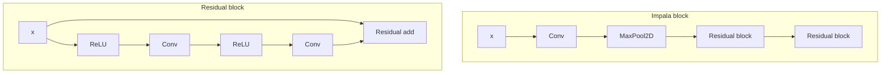
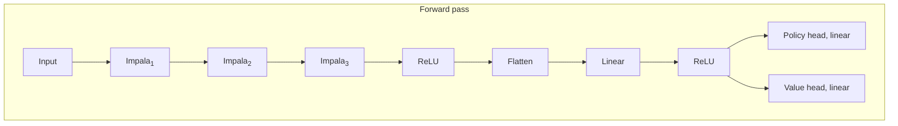
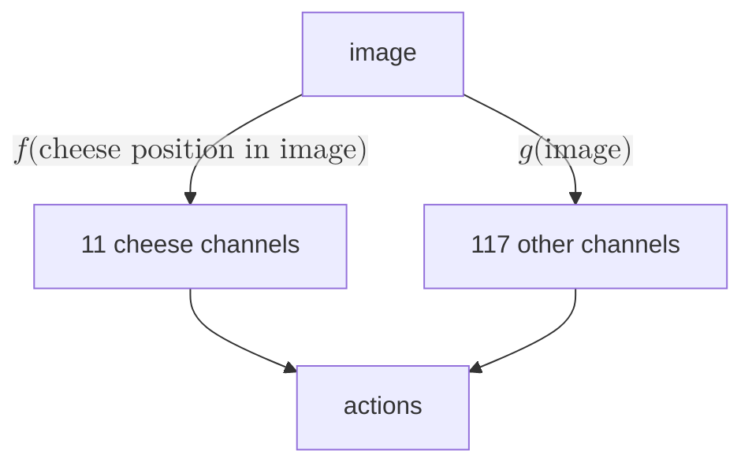

<video autoplay loop muted playsinline   webkit-playsinline preload="auto"><source src="https://assets.turntrout.com/static/images/posts/vyflftmbwgl7jmbaeimm.mp4" type="video/mp4; codecs=hvc1">
<source src="https://assets.turntrout.com/static/images/posts/vyflftmbwgl7jmbaeimm.webm" type="video/webm"></video>

Figure: **Locally** [**retargeting the search**](https://www.alignmentforum.org/posts/w4aeAFzSAguvqA5qu/how-to-go-from-interpretability-to-alignment-just-retarget) **by modifying a single activation.** We found a residual channel halfway through a maze-solving network. When we set one of the channel activations to +5.5, the agent often navigates to the maze location (shown above in red) implied by that positive activation. This allows limited on-the-fly redirection of the net's goals. <br/><br/>(_The red dot is not part of the image observed by the network_, it just represents the modified activation. Also, this GIF is selected to look cool. Our simple technique often works, but it isn't effortless, and some dot locations are harder to steer towards.)

We algebraically modified the net's runtime goals without finetuning. We also found (what we think is) a "motivational API" deep in the network. We used the API to retarget the agent.

> [!note] Summary of a few of the most interesting results
>
> [Langosco et al.](https://arxiv.org/abs/2105.14111) trained a range of maze-solving nets. We decided to analyze one which we thought would be interesting. The network we chose has 3.5M parameters and 15 convolutional layers.
>
> 1. This network can be attracted to a target location nearby in the maze—all this by modifying a _single_ activation, out of tens of thousands\. This works reliably when the target location is in the upper-right, and not as reliably when the target is elsewhere.
> 2. Considering several channels halfway through the network, we hypothesized that their activations mainly depend on the location of the cheese.
>    - We tested this by resampling these activations with those from another random maze (as in [causal scrubbing](https://www.lesswrong.com/posts/JvZhhzycHu2Yd57RN/causal-scrubbing-a-method-for-rigorously-testing)). We found that as long as the second maze had its cheese located at the same coordinates, the network's behavior was roughly unchanged. However, if the second maze had cheese at different coordinates, the agent's behavior was significantly affected.
>    - This suggests that these channels are inputs to goal-oriented circuits, and these channels affect those circuits basically by passing messages about where the cheese is.
> 3. Our statistical analysis suggests that the network decides whether to acquire cheese not only as a function of path-distance to cheese, but—after controlling for path-distance—_also_ as a function of _Euclidean/"perceptual" distance_ between the mouse and the cheese, even though the agent sees the whole maze at once.
> 4. Another simple idea: We define a "cheese vector" as the difference in activations when the cheese is present in a maze, and when the cheese is not present in the same maze. For each maze, we generate a single cheese vector and subtract that vector from all forward passes in that maze. The agent now ignores cheese most of the time, instead heading towards the top-right region (the historical location of cheese). Furthermore, a given maze's cheese vector transfers across mazes to other mazes with cheese in the same location.
>    - We propose the _algebraic value-editing conjecture_ (AVEC): It's possible to deeply modify a range of alignment-relevant model properties, without retraining the model, via techniques as simple as "run forward passes on prompts which e.g. prompt the model to offer nice- and not-nice completions, and then take a 'niceness vector' to be the diff between their activations, and then add the niceness vector to future forward passes."

# Introducing the training process and visualizations

> [!note]
> In this post, we'll mostly discuss _what_ we found, not what our findings mean.

Let's run through some facts about [Langosco et al.](https://arxiv.org/abs/2105.14111)'s training process. Mazes had varying effective sizes, ranging from 3x3 to 25x25:


Figure: Mazes range from cute little 3x3 mazes to more substantial 25x25 puzzles. Mazes are always solvable and always [simply connected](https://www.britannica.com/topic/number-game/Mazes#ref396167)—e.g. no loops or islands in the middle of the maze.


Figure: The smaller mazes are padded out with walls to fill the 25x25 game grid. In this post, we usually render mazes without padding.


Figure: We humans see a nice, zoomed-in, high-resolution maze. The network sees a 64x64 RGB maze. The model _always sees the entirety of the maze_.

Each 64x64 RGB observation is processed by a deeply convolutional (15 conv layers!) network, without memory (i.e. no recurrent state):





Code: For more background on training and architecture and task set, see [the original paper](https://arxiv.org/abs/2105.14111) and [the model training repo](https://github.com/jbkjr/train-procgen-pytorch).

<br/>


<br/>Figure: During RL training, cheese was randomly located in the top-right 5x5 corner of the randomly generated mazes. In deployment, cheese can be anywhere. What will the agent do?

<video autoplay loop muted playsinline><source src="https://assets.turntrout.com/static/images/posts/h1c8tfpmpebrjhcrqv17.mp4" type="video/mp4; codecs=hvc1">
<source src="https://assets.turntrout.com/static/images/posts/h1c8tfpmpebrjhcrqv17.webm" type="video/webm"></video>

Figure: Sometimes, the agent goes to the cheese.

<video autoplay loop muted playsinline><source src="https://assets.turntrout.com/static/images/posts/cl7cobzn4pqpwfxotgco.mp4" type="video/mp4; codecs=hvc1">
<source src="https://assets.turntrout.com/static/images/posts/cl7cobzn4pqpwfxotgco.webm" type="video/webm"></video>

Figure: Sometimes, the agent ignores the cheese. (Maze colors vary.)

Why does the agent go to the cheese sometimes, and the top-right corner other times?

It's not that the agent wasn't trained for long enough.


<br/>Figure: Reaching the cheese yields +10 reward. The net is trained until it reaches the cheese basically every episode. While Langosco et al. didn't include an episodic reward curve for their 5x5\-rand region network (the net we analyzed), Uli reproduced their results on a freshly trained network (shown above; see [`wandb` graphs](https://wandb.ai/uli/objective-robustness/reports/Rand-region-5-training--VmlldzozNjk3NDUx?accessToken=qs7b5osgimhtyav2y3lhjztsuvogybt1zvi6mehsh3pqmnvqrepnn33z220i130o) for more). We analyze Langosco et al.'s 5x5 net.

Sampling rollouts from the trained policy adds a lot of noise. It's also hard to remember what the agent did in what part of the maze. To better understand this mouse, we'll take a bird's-eye view.

A nicer way to view episodes is with a vector field view, which overlays a vector field representing the agent policy for a given maze.


<br/>Figure: At each square in the maze, we run a forward pass to get the policy's action probabilities at that square.


<br/>Figure: Vector fields display the output probabilities from the policy at every mouse position in seed 0. The _action component vectors_ multiply e.g. $p_\texttt{left}$ times the left-pointing unit vector. The _net probability vectors_ have coordinates $x = p_\texttt{right}-p_\texttt{left}$ and $y = p_\texttt{up}-p_\texttt{down}$.

While the net probability vector field leaves open two degrees of freedom per net probability vector,[^1] in practice it seems fine for eyeballing mouse behavior.

# Behavioral analysis

When in doubt, _get more data._ When Alex was setting directions but didn't know what to do, he'd think "what data firehydrants can I crack open?". Once we [made our predictions](https://www.alignmentforum.org/posts/JusJcepE2qohiC3hm/predictions-for-shard-theory-mechanistic-interpretability), there was no reason to hold back.

Uli cracked open the vector field hydrant.

> [!question] Investigation
> Pore through the following vector fields for as little or as much time as you please. Do you notice any patterns in when the mouse goes to the cheese?


Figure: To generate your own mazes, play with this [Colab notebook](https://colab.research.google.com/drive/1zHk6jxjTjQ4yL12Fbp3REpTXsqQGV1dp?usp=sharing).

If we want an agent which generally pursues cheese, we didn't quite _fail_, but we also didn't quite _succeed_. Just look at seed 59,195 above—once a mere three tiles north of the cheese, the mouse navigates to the top-right corner! In the language of [shard theory](/shard-theory), there seems to be a conflict between the "top-right corner shard" and the "cheese shard." Is that actually a reasonable way to describe what's happening?

> [!failure] There are more than two shards
> The agent's goals are not some combination of "get cheese" and "go to the top-right region."
>
>  <br/>Figure: The agent settles far below the top-right 5x5 region of seed 0. This "failure" to reach the top-right crops up in several seeds we've found.
>
> We only recently realized and corrected this mistake. We had expected to find (at least) a top-right goal and a cheese goal, and so wrote off deviations (like seed 0) as "exceptions." It's true that often the agent _does_ go to the top-right 5x5 region, especially when cheese isn't nearby. We also think that the agent has some kind of top-right goal. But the agent's goals are richer than _just_ "go to the top-right" and "go to the cheese."

## Behavioral statistics

Imagine that you're looking at a maze and trying to predict whether the mouse will go to the cheese. Having looked at some videos, you guess that the agent tends to go to (somewhere near) the top-right, and sometimes goes to the cheese.

Some mazes are easy to predict, because the cheese is _on the way_ to the top-right corner. There's no _decision square_ where the agent has to make the hard choice between the paths to the cheese and to the top-right corner:


<br/>Figure: At the decision square, the agent must choose between two paths—cheese, and top-right.

So let's just predict mazes with decision squares. In the above red-dotted maze with a decision square (`seed=0`), how would you guess whether the mouse goes to the cheese or not? What features should you be paying attention to?

You might naively guess that the model has learned to be a classic RL agent, which cares about path distances alone, with greater distances meaning more strongly discounted cheese-reward.

Eyeballing videos of the model's test-distribution trajectories, we noticed three apparent factors behind the agent's choice between "cheese paths" and "maze-end paths":

<ol type="A">
<li>How close the decision square is to the cheese.</li>
<li>How close the decision square is to the top-right square.</li>
<li>How close the cheese is to the top-right square.</li>
</ol>

We performed $L_1$\-regularized [multiple logistic regression](https://www.statstest.com/multiple-logistic-regression/)[^3] on "did the mouse reach the cheese?" using every reasonable formalization of these three criteria. We classified trajectories from 8,000 randomly chosen mazes and validated on trajectories from 2,000 additional mazes. Regressing on all reasonable formalizations of these criteria, we found that four feature were helpful for predicting cheese attainment:


<br/>Figure: These factors all matter, even when already considering the other three. Our winning combo of four factors contains two formalizations of "How close the decision square is to the cheese.", one of "How close the decision square is to the top-right square", and one of "How close the cheese is to the top-right square."

By regressing on these four factors, the model achieved a prediction accuracy of 83.3% on whether the (stochastic) policy navigates to cheese on held-out mazes. For reference, the agent gets the cheese in 69.1% of these mazes, and so a simple "always predict 'gets the cheese'" predictor would get 69.1% accuracy.

Here are the regression coefficients for predicting +1 (agent gets cheese) or 0 (agent doesn't get cheese). For example, -0.623 corresponds to 0.623 fewer logits on predicting that the agent gets cheese.

Decision square's Euclidean distance to cheese, negative (-0.623)
: _The greater the _visual distance_ between the cheese and the decision square, the less likely the agent is to go to the cheese._

: As we privately speculated, this effect shows up _after_ accounting for the path distance (factor 2) between the decision square and the cheese.
: This is not behavior predicted by "classic" RL training reasoning, which focuses on policies being optimized strictly as a function of sum discounted reward over time (and thus, in the sparse reward regime, in terms of path distance to the cheese).
: We did predict this using shard theory reasoning. The one behavioral experiment which Alex proposed before the project was to investigate whether this factor exists, after controlling for path distance.

Decision square's path distance to cheese, negative (-1.084)
: _The farther the agent has to walk to the cheese, the less likely it is to do so._
: This seemed like the obvious effect to predict to us, and its regression coefficient was indeed larger than the coefficient for Euclidean distance (-0.623).

Cheese's Euclidean distance to top-right free square, negative (-2.786)
: _The closer the cheese is to the top-right, the more likely the agent is to go for the cheese._

: The L2 distance to the cheese is **the strongest factor.** After piling up evidence from a range of mechanistic and behavioral sources, we're comfortable concluding that _cheese affects decision-making more when it's closer to the top-right_. See this footnote[^4] for an example maze illustrating the power of this factor.
: In the language of shard theory, the cheese-shard is more strongly activated when cheese is closer to the top-right.
: Notably, this factor isn't trivially influential—we're only considering mazes with decision squares, so the cheese isn't on the way to the top-right corner! Furthermore, as with all factors, this factor matters when controlling for the others.
**Decision square's Euclidean distance to the top-right** 5x5 **corner, positive (**+1.326). The _farther_ the decision square from the top-right 5x5 corner, the _more likely_ the agent is to choose "cheese."
: This has the opposite of the sign we expected. We thought the sign would be negative. Surely if the agent is farther from the 5x5 corner, the decision context is less similar to its historical cheese reinforcement events in that corner?
: This factor _does_ have the hypothesized sign when we regress on it in isolation from all other variables, but dropping this factor from the multiple linear regression significantly deteriorates its predictive accuracy.
: We are confused and don't fully understand which logical interactions produce this positive regression coefficient.

Overall, the first three results line up with our hands-on experience with the net's behavior. The last result is an interesting outlier which probably stems from not using a more sophisticated structural model for regression.

> [!success] [Later statistical analysis](/statistics-of-a-maze-solving-network) supports and expands on these conclusions

# Subtract the "cheese vector", subtract the cheese-seeking?

> [!note] Section summary
> We consider the vector difference of activations from observations with and without cheese present. Subtracting this vector from a typical run will make the network approximately ignore the cheese. Applying this value-editing technique more generally could be a simple way to significantly change the goals of agents, without retraining.
>
> Consult the [interactive Colab](https://colab.research.google.com/drive/1fPfehQc1ydnYGSDXZmA22282FcgFpNTJ?usp=sharing) for more results.

To understand the network, we tried various hand-designed model edits. These edits change the forward pass, without any retraining or optimization. To see the effect of a modification, we display the diff between the vector fields:

<figure>
<div style="display:flex; justify-content: center; ">
<div class="subfigure">

<figcaption>(a) Original probabilities</figcaption>
</div>
<div class="subfigure">

<figcaption>(b) Steered probabilities</figcaption>
</div>
<div class="subfigure">

<figcaption>(c) Steered minus original</figcaption>
</div>
</div>
<figcaption><b>Left:</b> The net probability vectors induced by the unmodified forward passes.  
<br/><b>Middle:</b> For any steering modification we make to forward passes, we plot the new probability vectors induced by the modified forward passes.  <br/>
<b>Right:</b> The “vector field diff”, computed as (steered minus original) for each valid position in the maze. At a glance, we understand the behavioral effect of modifying the network.</figcaption>
</figure>

On [Team Shard](matsprogram.org/mentors), we run fast experiments ASAP, looking for the fastest way to get interesting information. Who cares about a lit review or some fancy theory, when you can try something interesting immediately?

Sometimes, the simple idea even _works_. Inspired by [the "truth vector" work](https://arxiv.org/abs/2212.03827), Alex thought:[^6]

> What if taking the difference in activations at a certain layer gave us a "cheese" vector? Could we subtract this from the activations to make the mouse ignore the cheese?

Yup! This hand-selected intervention works, without retraining the network! In the following maze, the unmodified network (left) goes to the cheese from the starting position. However, the modified network seems to ignore the cheese entirely!


<br/>Figure: Vector fields for the mouse normally, for the mouse with the cheese vector subtracted during every forward pass, and the diff between the two cases.

## Computing the cheese vector

What did we do here? To compute the cheese vector, we

1. Generate two observations—one with cheese, and one without. The observations are otherwise the same.
2. Run a forward pass on each observation, recording the activations at each layer.
3. For a given layer, define the cheese vector to be `CheeseActivations - NoCheeseActivations`. The cheese vector is a vector in the vector space of activations at that layer.

Let's walk through an example, where for simplicity the network has a single hidden layer, taking each observation (shape `(3, 64, 64)` for the 64x64 RGB image) to a two-dimensional hidden state (shape `(2,)`) to a logit vector (shape `(15,)`[^7] ).


1. We run a forward pass on a batch of two observations, one with cheese (note the glint of yellow in the image on the left!) and one without (on the right).
2. We record the activations during each forward pass. In this hypothetical,
    - `CheeseActivations := (1, 3)`
    - `NoCheeseActivations := (0, 2)`
3. Thus, the cheese vector is $(1, 3) - (0, 2) = (1, 1)$.

Now suppose the mouse is in the top-right corner of this maze. Letting the cheese be visible, suppose this would _normally_ produce activations of $(0,0)$. Then we modify the forward pass by subtracting the cheese vector from the normal activations, giving us $(0,0)-(1,1)=(-1,-1)$ for the modified activations. We then finish off the rest of the forward pass as normal.

In the real network, there are a lot more than two activations. Our results involve a 32,768-dimensional cheese vector subtracted from about halfway through the network.

> [!note]- Forward pass diagram highlighting the intervention site
>
> ```mermaid
> graph TD
>     subgraph ImpalaBlock[Impala block]
>         IB_X[x] --> IB_Conv[Conv]
>         IB_Conv --> IB_MaxPool[MaxPool2D]
>         IB_MaxPool --> IB_Res1[Residual block]:::green
>         IB_Res1 --> IB_Res2[Residual block]
>     end
>
>     subgraph ResidualBlock[Residual block]
>         RB_X[x] --> RB_ReLU1[ReLU]
>         RB_ReLU1 --> RB_Conv1[Conv]
>         RB_Conv1 --> RB_ReLU2[ReLU]
>         RB_ReLU2 --> RB_Conv2[Conv]
>         RB_X --> RB_Add[Residual add]:::green
>         RB_Conv2 --> RB_Add
>     end
> ```
>
> ```mermaid
> graph TD
>   subgraph OverallGraph["Forward pass"]
>     Input --> Impala1
>           Impala1["Impala<sub>1</sub>"] --> Impala2:::green
>           Impala2["Impala<sub>2</sub>"] --> Impala3
>           Impala3["Impala<sub>3</sub>"] --> ReLU1
>           ReLU1["ReLU"] --> Flatten
>           Flatten --> Linear
>           Linear --> ReLU2
>           ReLU2["ReLU"] --> PolicyHead[Policy head, linear]
>           ReLU2 --> ValueHead[Value head, linear]
>   end
> ```
>
> Code: We modify the activations after the residual add layer in the first residual block of the second Impala block.

Now that we're done with preamble, let's see the cheese vector in action! Here's a seed where subtracting the cheese vector is effective at getting the agent to ignore cheese:


<br/>Figure: Vector fields for the mouse normally, for the mouse with the cheese vector subtracted during every forward pass, and the diff between the two cases.

How is our intervention not trivially making the network output logits as if the cheese were not present? Is it not true that the activations at a given layer obey the algebra of `CheeseActiv - (CheeseActiv - NoCheeseActiv) = NoCheeseActiv`?

The intervention is not trivial because we compute the cheese vector based on observations when the mouse is at the _initial_ square (the bottom-left corner of the maze), but apply it for _forward passes throughout the entire maze_ — where the algebraic relation no longer holds. Indeed, we later show that this subtraction does _not_ produce a policy which acts as if it can't see the cheese.

## Quantifying the effect of subtracting the cheese vector

To quantify the effect of subtracting the cheese vector, define $P(\text{cheese}\mid\text{decision square})$ to be the probability the _policy_ assigns to the action leading to the cheese from the decision square where the agent confronts a fork in the road. As a refresher, the red dot demarcates the decision square in seed 0:


<br/>Figure: At the decision square, the agent must choose between the paths to the cheese and to the top-right corner.

Across seeds 0 to 99, subtracting the cheese vector has a large effect:


<br/>Figure: The cheese vector decreases median P(cheese | decision square) from .81 to .03, while increasing P(top-right | decision square) substantially. The third plot shows a mostly unaffected probability of taking other actions (like $\texttt{no-op}$ or returning to the start of the maze).


<br/>Figure: Of the hundred mazes, subtracting the cheese vector noticeably increases P(cheese) in a _single_ seed (`16`), and only by .005. (There are a few other extremely small increases; all of these tiny increases seem like noise to me. See [the Colab](https://colab.research.google.com/drive/1fPfehQc1ydnYGSDXZmA22282FcgFpNTJ?usp=sharing) for interactive plots.)

What is the cheese vector doing to the forward passes? A few hints:

### Not much happens when you add the cheese vector


<br/>Figure: Our first hypothesis was that we were adding/subtracting some kind of "global cheese motivation." If that had been true, adding the cheese vector should have increased cheese-seeking. In reality, not much happened.

### The cheese vector from seed A usually doesn't work on seed B

Taking `seed=0`'s cheese vector and applying it in `seed=3` also does nothing:


<br/>Figure: Transfer failure: the cheese vector from seed 0 fails to have any effect on the seed 3 vector field.

### Subtracting the cheese vector isn't similar to randomly perturbing activations

At this point, we got worried. Are we just decreasing P(cheese) by randomly perturbing the network's cognition?

No. We randomly generated numbers of similar magnitude to the cheese vector entries, and then added those numbers to the relevant activations. This destroys the policy and makes it somewhat incoherent:


<br/>Figure: A control: the mouse's vector field when a random vector is added to the model's activations at the relevant layer.

## Does the cheese vector modify the ability to see cheese?

At this point, Peli came up with an intriguing hypothesis. What if we're locally modifying the network's ability to _see_ cheese at the given part of the visual field? Subtracting the cheese vector would mean "nothing to see here", while adding the cheese vector would correspond to "there's super duper definitely cheese here." But if the model can already see cheese just fine, increasing "cheese perception" might not have an effect.

### Transferring the cheese vector between mazes with similarly located cheese

This theory predicts that a cheese vector will transfer across mazes _as long as cheese is in the same location in both mazes_.


<br/>Figure: Two seeds with cheese at the same position in the observation.

That's exactly what happens.


<br/>Figure: The cheese vector from seed 0 also works on seed 795.

In fact, a cheese vector taken from a maze with cheese location $(x,y)$ often transfers to mazes with cheese at nearby $(x',y')$ for $|x-x'|,|y-y'|\leq 2$ . So the cheese doesn't have to be in _exactly_ the same spot to transfer.

### Comparing the modified network against behavior when cheese isn't there

If the cheese vector were strictly removing the agent's ability to perceive cheese at a given maze location, then the following two conditions should yield identical behavior:

1. Cheese not present, network not modified.
2. Cheese present, with the cheese vector subtracted from the activations.

Sometimes these conditions do in fact yield identical behavior!


<br/>Figure: Note how the "difference" vector field is full of ~zero vectors.


That's a _lot_ of conformity, and that conformity demands explanation! Often, the cheese vector is basically making the agent act as if there isn't cheese present.

Sometimes there are differences:


<br/>Figure: The difference between _removing the cheese from the maze_ and _subtracting the cheese vector_ _with the cheese present._ In this instance, the two don't identically affect the policy.

## Speculation about the implications of the cheese vector

Possibly this is mostly a neat trick which sometimes works in settings where there's an obvious salient feature which affects decision-making (e.g. presence or absence of cheese).

If we may dream for a moment, there's also the chance of...

> [!idea] The algebraic value-editing conjecture (AVEC)
> It's possible to deeply modify a range of alignment-relevant model properties, without retraining the model, via techniques as simple as "run forward passes on prompts which e.g. prompt the model to offer nice- and not-nice completions, and then take a 'niceness vector', and then add the niceness vector to future forward passes."

Alex is ambivalent about strong versions of AVEC being true. Early on in the project, he booked the following credences (with italicized updates from present information):

> [!quote]
>
> 1. Algebraic value editing works on Atari agents
>     1. 50%
>     2. 3/4/23: updated down to 30% due to a few other "X vectors" not working for the maze agent
>     3. 3/9/23: updated up to 80% based off of additional results not in this post.
> 2. AVE performs at least as well as the fancier buzzsaw edit from [RL vision paper](https://distill.pub/2020/understanding-rl-vision/)
>     1. 70%
>     2. 3/4/23: updated down to 40% due to realizing that the buzzsaw moves in the visual field; higher than 30% because we know something like this is possible.
>     3. 3/9/23: updated up to 60% based off of additional results.
> 3. AVE can quickly ablate or modify LM values without any gradient updates
>     1. 60%
>     2. 3/4/23: updated down to 35% for the same reason given in (1)\.
>     3. 3/9/23: updated up to 65% based off of additional results and learning about related work in this vein.

And even if (3) is true, AVE working _well_ or _deeply_ or _reliably_ is another question entirely. Still...

The cheese vector was easy to find. We immediately tried the _dumbest, easiest_ first approach. We didn't even train the network ourselves, we just used one of Langosco et al.'s nets (the first and only net we looked at). If this is the amount of work it took to (mostly) stamp out cheese-seeking, then perhaps a simple approach can stamp out e.g. deception in sophisticated models.

> [!success] Looking back from 2024, AVEC seems true
> For example, see [Steering GPT-2 by Adding an activation vector](/gpt2-steering-vectors) and [Steering Llama-2 with contrastive activation addition](/steering-llama-2-with-contrastive-activation-additions.md). My work (and concurrent work by [Li et al.](https://arxiv.org/abs/2306.03341)) grew into a small research field of its own (including e.g. later work in [Representation Engineering](https://arxiv.org/abs/2310.01405)).
>
> I consider AVEC to be my most successful prediction ever. Using minimal evidence, I located and stood by the AVEC hypothesis, even though many of my colleagues were incredulous. _Once I saw a few trajectories of the "cheese vector" working, I instantly realized the implications for large language models and assigned that 60% probability._

## Towards more granular control of the net

We had this cheese vector technique pretty early on. But we still felt frustrated. We hadn't made much progress on understanding the network, or redirecting it in any finer way than "ignore cheese"...

That was about to change. Uli built a graphical maze editor, and Alex had built an activation visualization tool, which automatically updates along with the maze editor:

<video autoplay loop muted playsinline><source src="https://assets.turntrout.com/static/images/posts/u9fehxegabydsaxguzaa.mp4" type="video/mp4; codecs=hvc1">
<source src="https://assets.turntrout.com/static/images/posts/u9fehxegabydsaxguzaa.webm" type="video/webm"></video>

Figure: Inspection reveals that channel 55 (visualized) puts positive numbers (blue) on cheese and negative (red) elsewhere. Use [this Colab](https://colab.research.google.com/drive/11yqoQgckV3lpe7adN0gkaqUcsKEutiCS?usp=sharing) to play around with the activations yourself.

Peli flicked through the channels affected by the cheese vector. He found that channel 55 of this residual layer put positive (blue) numbers where the cheese is, and negative (red) values elsewhere. Seems promising.

Peli zero-ablated the activations from channel 55 and examined how that affected vector fields for dozens of seeds. He noticed that zeroing out channel 55 reliably but subtly decreased the intensity of cheese-seeking, without having other effects on behavior.

This was our "in"—we had found a piece of the agent's cognition which seemed to _only_ affect the probability of seeking the cheese. Had we finally found a cheese subshard—a subcircuit of the agent's "cheese-seeking motivations"?

# Retargeting the agent to maze locations

> [!note] Section summary
> A few mid-network channels have disproportionate and steerable influence over final behavior. We take the wheel and steer the mouse by clamping a single activation during forward passes.

Alex had a hunch that if he moved the positive numbers in channel 55, he'd move the mouse in the maze. (In a fit of passion, he failed to book predictions before finding out.) As shown in the introduction, that's exactly what happens.

<video autoplay loop muted playsinline><source src="https://assets.turntrout.com/static/images/posts/vyflftmbwgl7jmbaeimm.mp4" type="video/mp4; codecs=hvc1">
<source src="https://assets.turntrout.com/static/images/posts/vyflftmbwgl7jmbaeimm.webm" type="video/webm"></video>

To understand in mechanistic detail what's happening here, it's time to learn a few more facts about the network. Channel 55 is one of 128 residual channels at a `ResidualAdd` layer halfway through the network.

> [!note]- Forward pass diagram highlighting the intervention site
>
> ```mermaid
> graph TD
>     subgraph ImpalaBlock[Impala block]
>         IB_X[x] --> IB_Conv[Conv]
>         IB_Conv --> IB_MaxPool[MaxPool2D]
>         IB_MaxPool --> IB_Res1[Residual block]:::green
>         IB_Res1 --> IB_Res2[Residual block]
>     end
>
>     subgraph ResidualBlock[Residual block]
>         RB_X[x] --> RB_ReLU1[ReLU]
>         RB_ReLU1 --> RB_Conv1[Conv]
>         RB_Conv1 --> RB_ReLU2[ReLU]
>         RB_ReLU2 --> RB_Conv2[Conv]
>         RB_X --> RB_Add[Residual add]:::green
>         RB_Conv2 --> RB_Add
>     end
> ```
>
> ```mermaid
> graph TD
>   subgraph OverallGraph["Forward pass"]
>     Input --> Impala1
>           Impala1["Impala<sub>1</sub>"] --> Impala2:::green
>           Impala2["Impala<sub>2</sub>"] --> Impala3
>           Impala3["Impala<sub>3</sub>"] --> ReLU1
>           ReLU1["ReLU"] --> Flatten
>           Flatten --> Linear
>           Linear --> ReLU2
>           ReLU2["ReLU"] --> PolicyHead[Policy head, linear]
>           ReLU2 --> ValueHead[Value head, linear]
>   end
> ```
>
> Code: We modify the activations after the residual add layer in the first residual block of the second Impala block.

Each of these 128 residual add channels is a 16x16 grid. For channel 55, moving the cheese e.g. to the left will [equivariantly](https://en.wikipedia.org/wiki/Equivariant_map) move channel 55's positive activations to the left. There are several channels like this, in fact:

<video autoplay loop muted playsinline><source src="https://assets.turntrout.com/static/images/posts/z5jub7jnrdc7c71vhbpa.mp4" type="video/mp4; codecs=hvc1">
<source src="https://assets.turntrout.com/static/images/posts/z5jub7jnrdc7c71vhbpa.webm" type="video/webm"></video>

Figure: By visually inspecting the 128 residual addition output channels, Peli and Alex found eleven channels which visibly and equivariantly track the location of the cheese. Namely: 7, 8, 42, 44, 55, 77, 82, 88, 89, 99, 113.

To retarget the agent as shown in the GIF, modify channel 55's activations by _clamping a single activation to have a large positive value_, and then complete the forward pass normally.


<br/>Figure: Normally, channel 55 codes cheese with positive (blue) values around 0.6. We patch in a higher artificial value of e.g. 5.6 at the target location because that's more effective.

If you want the agent to go to e.g. the middle of the maze, clamp a positive number in the middle of channel 55.[^8] Often that works, but sometimes it doesn't. Look for yourself:

<video autoplay loop muted playsinline><source src="https://assets.turntrout.com/static/images/posts/phdm6uoq0djzqybscgrz.mp4" type="video/mp4; codecs=hvc1">
<source src="https://assets.turntrout.com/static/images/posts/phdm6uoq0djzqybscgrz.webm" type="video/webm"></video>

Figure: Seed 0. The red dot indicates the maze location of the clamped positive activation. This retargeting works reliably in the top half of `seed=0`, but less well in the bottom half. This pattern appears to hold across seeds, although we haven't done a quantitative analysis of this.

<br/>

<video autoplay loop muted playsinline><source src="https://assets.turntrout.com/static/images/posts/xafpj5bsljohtcar76nz.mp4" type="video/mp4; codecs=hvc1">
<source src="https://assets.turntrout.com/static/images/posts/xafpj5bsljohtcar76nz.webm" type="video/webm"></video>

Figure: Seed 60.

Clamping an activation in channel 88 produces a similar effect. However, modifying channel 42 has a different effect:

<video autoplay loop muted playsinline><source src="https://assets.turntrout.com/static/images/posts/vsplnp2dbe4sz0usspf8.mp4" type="video/mp4; codecs=hvc1">
<source src="https://assets.turntrout.com/static/images/posts/vsplnp2dbe4sz0usspf8.webm" type="video/webm"></video>

Channel 42's effect seems strictly more localized to certain parts of the maze—possibly including the top-right corner. Uli gathered mechanistic evidence from integrated gradients that e.g. channels 55 and 42 are used differently by the rest of the forward pass.

<hr/>

As mentioned before, we leafed through the channels and found eleven which visibly track the cheese as we relocate it throughout a maze. It turns out that you can modify all the channels at once and retarget behavior that way:

<video autoplay loop muted playsinline><source src="https://assets.turntrout.com/static/images/posts/wd5rb3yvlhshfaeaguzd.mp4" type="video/mp4; codecs=hvc1">
<source src="https://assets.turntrout.com/static/images/posts/wd5rb3yvlhshfaeaguzd.webm" type="video/webm"></video>

Here's retargetability on three randomly generated seeds (we uploaded the first three, not selecting for impressiveness):

<figcaption>Seed 45,720</figcaption>

<video autoplay loop muted playsinline><source src="https://assets.turntrout.com/static/images/posts/hlv0nboiwjhb1jdenjc2.mp4" type="video/mp4; codecs=hvc1">
<source src="https://assets.turntrout.com/static/images/posts/hlv0nboiwjhb1jdenjc2.webm" type="video/webm"></video>

<figcaption>Seed 45,874 isn't retargetable.</figcaption>

<video autoplay loop muted playsinline><source src="https://assets.turntrout.com/static/images/posts/dhjhldyhmp4ec7pbsqun.mp4" type="video/mp4; codecs=hvc1">
<source src="https://assets.turntrout.com/static/images/posts/dhjhldyhmp4ec7pbsqun.webm" type="video/webm"></video>

<figcaption>Seed 72,660 is a larger maze, which seems to allow greater retargetability.</figcaption>

<video autoplay loop muted playsinline><source src="https://assets.turntrout.com/static/images/posts/czduetvhfk6tfvpd8jvt.mp4" type="video/mp4; codecs=hvc1">
<source src="https://assets.turntrout.com/static/images/posts/czduetvhfk6tfvpd8jvt.webm" type="video/webm"></video>

The cheese subshards didn't have to be so trivially retargetable. For example, if the agent had used cheese locations to infer where top-right was, then channel 55 saying "cheese on the left" and channel 88 saying "cheese on the right" could seriously degrade the policy's maze-navigation competence.

## Causal scrubbing the cheese-tracking channels

We can often retarget the agent, but how and why does this work? What are these channels doing? Do they really just depend on cheese location, or is there other crucial information present?

We don't know the answers yet, but we have some strong clues.

<video autoplay loop muted playsinline><source src="https://assets.turntrout.com/static/images/posts/zsbfpcfdxxp0wzvrpcy5.mp4" type="video/mp4; codecs=hvc1">
<source src="https://assets.turntrout.com/static/images/posts/zsbfpcfdxxp0wzvrpcy5.webm" type="video/webm"></video>

Eyeballing these channels, it seems like the blue positive activations matter, but there's not that obvious of a pattern to the red negative areas. Maybe the reds are just random garbage, and the important information comes from the blue cheese location?

Channel 55's negative values can't affect computations in the _next_ residual block, because that starts with a ReLU. However, there is a computational pathway by which these negative values can affect the actions: the residual addition of the next residual block, which then feeds into a convolutional layer at the beginning of Impala block 3.

### Smoothing out the negative values

The negative values are usually around -.2. So instead of modifying just a single activation, we can replace all of them.


<br/>Figure: We can replace e.g. channel 55's activations with a synthetic set of activations which is -0.2 everywhere except the targeted value of +5.6. (The modified activations still have shape 16x16; a 4x4 grid is shown for visibility.)

This produces basically the same retargetability effect as the single-activation case, with the main side effect apparently just being a slightly lower attraction to the real cheese (presumably, because the positive activations get wiped out).

We found a range of other interesting algebraic modifications to channel 55 (e.g. "multiply all activations by -1" or "zero out all the negative values"), but we'll leave those for now.

### Randomly resampling channel activations from other mazes

So, channel 55. If this channel is only affecting the net's behavior by communicating information from where the cheese is, changing e.g. where the walls are shouldn't affect the decision-relevant information carried by 55. More precisely, we hypothesized the following computational graph about how the net works:



Code: We hypothesized that channels 7, 8, 42, 44, 55, 77, 82, 88, 89, 99, and 113 affect behavior only by passing along information computed based on where the cheese is in the 64x64 RGB image. The arrows implicitly represent the computation performed by other layers of the network.

We test this with random resampling:

1. For a target maze with cheese at location (0, 0), generate an alternative maze with cheese at (0, 0). The mazes aren't guaranteed to share any information except the same cheese location.
2. Compute a forward pass on the alternative maze and store the activations.
3. For each mouse position in the target maze, compute a forward pass on the target maze, but at the relevant residual add layer, stop and override the 11 channel activations with the values they took in the _alternative_ maze.
4. Finish the rest of the forward pass as normal.

This produces the resampled vector field. If our hypothesis is correct, then this shouldn't affect behavior, because the cheese channels only depend on the cheese location anyways. It wouldn't matter what the rest of the maze looks like.

### Behavior is lightly affected by resampling from mazes with the same cheese location


<br/>Figure: Activations resampled from another maze with **cheese at the same location**. Due to activation resampling, the action probability distributions changed by 0.2% on average in this maze. Note that one resampling on this seed produced a higher number.


<br/>Figure: Activations resampled from a maze with **cheese at a different** **location** (near the red dot). Due to activation resampling, the action probability distributions changed by 1.3% on average in this maze.

Considering only the four channels [shown in the GIF](#causal-scrubbing-the-cheese-tracking-channels):


<br/>Figure: Activations resampled from another maze with **cheese at the same location**. Due to activation resampling, the action probability distributions changed by 0.3% on average in this maze.


<br/>Figure: Activations resampled from a maze with **cheese at a different** **location** (near the red dot). Due to activation resampling, the action probability distributions changed by 1.0% on average in this maze.

Looks like behavior is mostly unaffected by resampling activations from mazes with cheese at the same spot, but moderately/strongly affected by resampling from mazes with cheese in a different location.

Let's stress-test this claim a bit. There are 128 residual channels at this part of the network. Maybe _most of them_ depend on where the cheese is? After all, cheese provided the network's reinforcement events during its RL training—reward events didn't come from anywhere else!

### Cheese location isn't important for other randomly resampled channels, on average


<br/>Figure: Randomly selecting 11 channels we aren't hypothesizing to be related to cheese computation, and then resampling their activations from another maze with **cheese in the same location**. Due to activation resampling, the action probability distributions changed by 0.6% on average in this maze.


<br/>Figure: Randomly selecting 11 channels we aren't hypothesizing to be related to cheese computation, and then resampling their activations from another maze with **cheese in a different location**. Due to activation resampling, the action probability distributions changed by 0.8% on average in this maze.

Unlike for our 11 hypothesized "cheese channels", the "non-cheese" channels seem about equally affected by random resamplings, regardless of where the cheese is.

|                          | Same cheese location | Different cheese location |
| -----------------------: | :------------------: | :-----------------------: |
|     11 "cheese" channels | 0.88%                | 1.26%                     |
| 11 "non-cheese" channels | 0.60%                | 0.54%                     |

Table: [Average change in action probabilities](https://en.wikipedia.org/wiki/Total_variation_distance_of_probability_measures) across 30 seeds.

Alex thinks these quantitative results were a bit weaker than he'd expect if our diagrammed hypothesis were true. The "same cheese location" numbers come out _higher_ for our cheese channels (supposedly only computed as a function of cheese location) than for the non-cheese channels (which we aren't making any claims about).

Probably we selected channels which have a relatively large effect on the action probabilities. See this footnote[^9] for some evidence towards this. We also think that the chosen statistic neglects important factors, like "are there a bunch of tiny changes in probabilities, or a few central squares with large shifts in action probabilities?".

Overall, we think the resampling results (especially the qualitative ones) provide pretty good evidence in favor of our hypothesized computational graph. You can play around with random resampling yourself in [this Colab notebook](https://colab.research.google.com/drive/1uAUc91NHdpMiJqjlwh6Lx1_32QNLki5Z?usp=sharing).

<hr/>

These results are some evidence that channel 55's negative activations are random garbage that doesn't affect behavior much. The deeply convolutional nature of the network means that distant activations are mostly computed using information from that distant part of the maze.[^10] If these negative values were important, then information from non-cheese parts of the maze would have been affected by random resampling, which (presumably?) would have affected behavior more.

In combination with synthetic (smoothed) activation patching evidence, we think that e.g. channel 55's primary influence comes from its positive values (which normally indicate cheese location) and not from its negative values.

We don't currently understand how to reliably wield e.g. channel 42 or when its positive activations strongly steer behavior. In fact, we don't yet deeply understand how any of these channels are used by the rest of the forward pass! We do have some preliminary results which are interesting. But not in this post.

# Related work

A limited but promising set of existing work uses interpretability tools to reverse-engineer, understand, and modify the behavior of RL agents. [Hilton et al.](https://distill.pub/2020/understanding-rl-vision) used attribution and dimensionality reduction to analyze another procgen environment (CoinRun), with one core result being conceptually similar to ours: they were able to blind the agent to in-game objects with small, targeted model edits, with demonstrable effects on behavior. However, they used optimization to find appropriate model edits, while we hand-designed simple yet successful model edits. Joseph Bloom also used attribution to [reverse-engineer a single-layer decision transformer](https://www.lesswrong.com/posts/bBuBDJBYHt39Q5zZy/decision-transformer-interpretability) trained on a grid-world task. Larger models have also been studied: [McGrath et al.](https://www.pnas.org/doi/abs/10.1073/pnas.2206625119) used probes and extensive behavioral analysis to identify human-legible chess abstractions in AlphaZero activations.

[Li et al.](https://arxiv.org/pdf/2210.13382) used non-linear probes on Othello-GPT in order to infer the model's representation of the board. They then intervened on the representation in order to retarget the next-move predictions. Like our work, they flexibly retargeted behavior by modifying activations. ([Neel Nanda](https://www.lesswrong.com/posts/nmxzr2zsjNtjaHh7x/actually-othello-gpt-has-a-linear-emergent-world) later showed that linear probes suffice.)

[Editing Models with Task Arithmetic](https://arxiv.org/abs/2212.04089) explored a "dual" version of our algebraic technique. That work took vectors between _weights_ before and after finetuning on a new task, and then added or subtracted task-specific weight-diff vectors. While our technique modifies _activations_, the techniques seem complementary, and both useful for alignment.

The broader conceptual approach of efficiently and reliably controlling (primarily language) model behavior post-training has a signficant literature, e.g. [Mitchell et al.](https://proceedings.mlr.press/v162/mitchell22a/mitchell22a.pdf), [De Cao et al.](https://arxiv.org/pdf/2104.08164.pdf), and [Li et al.](https://arxiv.org/pdf/2205.14217.pdf) The "steering vector difference" technique used to modify sentence style described in [Subramani et al.](https://arxiv.org/abs/2205.05124) is another example of simple vector arithmetic operations in latent spaces exhibiting complex, capabilities-preserving effects on behavior.

# Conclusion

The model empirically makes decisions on the basis of purely perceptual properties (e.g. visual closeness to cheese), rather than just the path distances through the maze you might expect it to consider. We infer (and recent predictors [expected](https://www.lesswrong.com/posts/JusJcepE2qohiC3hm/predictions-for-shard-theory-mechanistic-interpretability) that the model also hasn't learned a single "misgeneralizing" goal. We've gotten a lot of predictive and retargetability mileage out of instead considering what _collections_ of goal circuits and subshards the model has learned.

The model can be made to ignore its historical source-of-reinforcement, the cheese, by continually subtracting a fixed "cheese vector" from the model's activations at a single layer. Clamping a single activation to a positive value can attract the agent to a given maze location. These successes are evidence for a world in which models are _quite steerable_ via greater efforts at fiddling with their guts. Who knows, maybe the algebraic value-editing conjecture is true in a strong form, and we can just "subtract out the deception." Probably not.

<!-- vale off -->
But maybe.
<!-- vale on -->

<hr/>

Understanding, predicting, and controlling goal formation seems like a core challenge of alignment. Considering circuits activated by channels like 55 and 42, we've found (what we think are) cheese subshards with relatively little effort, optimization, or experience. We next want to understand how those circuits interact to produce a final decision.


<br/>Figure: A [mouse with cheese subshards](https://imgur.com/a/doRBRs4).

> [!thanks] Credits
> Work completed under [SERI MATS 3.0](https://www.serimats.org/). If you want to get into alignment research and work on projects like this, look out for a possible MATS 4.0 during this summer, and apply to the shard theory stream. If you're interested in helping out now, contact [`alex@turntrout.com`](mailto:alex@turntrout.com).
>
> The core MATS team (Alex, Uli, and Peli) all worked on code, theory, and data analysis to varying degrees. Individual contributions to this post:
>
> Ulisse Mini, shard theory MATS mentee
> : Proposing and visualizing vector fields (which quickly dispelled mistaken ideas we had about behavioral tendencies), crucial backend code and support, network retraining, and creating the maze editor and other maze management tools.
>
> Peli Grietzer, shard theory MATS mentee
> : Data collection and statistics, data analysis (e.g. locating channel 55), hypothesis generation (e.g. the cheese vector locally blinding the agent to cheese).
>
> Alex Turner (`TurnTrout`), shard theory MATS mentor
> : Ideas for the cheese vector and channel 55 retargetability, code, experiment design and direction, management, writing this post and generating the media.
>
> Monte MacDiarmid, independent researcher
> : Code/infrastructure (e.g. hooking and patching code), advice.
>
> David Udell, independent researcher
> : Helped write this post.
>
> This post only showcases some of the results of our MATS research project. For example, we're excited to release more of Uli's work on e.g. visualizing capability evolution over the course of training, and computing value- and policy-head agreement, and Monte's work on linear probes and weight reflections. Our repo is [`procgen_tools`](https://github.com/UlisseMini/procgen-tools).
>
> Thanks to Andrew Critch, Adrià Garriga-Alonso, Lisa Thiergart and Aryan Bhatt for feedback on a draft. Thanks to Neel Nanda for feedback on the original project proposal. Thanks to Garrett Baker, Peter Barnett, Quintin Pope, Lawrence Chan, and Vivek Hebbar for helpful conversations.

[^1]: If the net probability vector is the zero vector, that could mean:

    1. $P(\texttt{no-op})=1$, or
    2. $P(\texttt{left})=P(\texttt{right})>0$, or
    3. $P(\texttt{up})=P(\texttt{down})>0$.

    Thus, there are two degrees of freedom by which we can convert between action probability distributions and yet maintain a fixed net probability vector. This is because net probability vector fields project a probability distribution on 5 actions (4 DOF) onto a single vector (2 DOF: angle and length), and so 4 - 2 = 2 DOF remain.

[^3]:
    Peli consulted with a statistician on what kind of regression to run. Ultimately, the factors we used are not logically independent of each other, but our impression after consultation was that this analysis would tell us _something_ meaningful.

    > [!quote] Peli's description of the statistical methodology
    >
    > I did multiple logistic regression with all the factors at once, then did a multiple logistic regression with all-factors-except-_x_ for each _x_ and wrote down which factors caused test accuracy loss when dropped.
    >
    > Four factors caused non-trivial test accuracy loss, so I took those four factors and did a multiple logistic regression on these four factors, and saw that the test accuracy was as good as with all factors.
    >
    > I then tested dropping each of the four factors and using just three, and saw that there was a non-trivial drop in test accuracy for each of them.
    >
    > I then tested adding one additional factor to the four factors, trying every unused factor and seeing no increase in test accuracy.

    Here are the factors we included in the initial regression, with the final four factors bolded with coefficients given:

    |                                              Chosen factor | Regression coefficient |
    | ---------------------------------------------------------: | :--------------------- |
    |           Euclidean distance from cheese to top right cell | -2.786                 |
    |        Euclidean distance from "decision square" to cheese | -0.623                 |
    |       Legal path distance from "decision square" to cheese | -1.084                 |
    | Euclidean distance from "decision square" to top right 5x5 | 1.326                  |

    Other factors we considered:

    - Euclidean distance from cheese to top right 5x5
    - Legal path distance from cheese to top right cell
    - Legal path distance from cheese to top right 5x5
    - Euclidean distance from "decision square" to top right cell
    - Legal path distance from "decision square" to top right cell
    - Legal path distance from "decision square" to top right 5x5
    - $L_2$ norm of the cheese global coordinates (e.g. $(0,10)\mapsto 10$)

[^4]: An example of the power of cheese Euclidean distance to top-right corner:
    <figcaption>In this maze, the mouse will happily detour four squares on its path to the top-right to pick up the cheese...</figcaption><p></p><figcaption>…but in <em>this</em> maze won't detour the <em>measly two squares</em> for the cheese. Empirically, how far the _cheese_ lies from the top-right matters a great deal.</figcaption><br/>Note that this result obtains even though the second maze has cheese at $\frac{1}{\sqrt{2}}$ the visual distance ($2$ instead of $2\sqrt{2}$) and at half the path-distance ($2$ instead of $4$). Cheese tends to be more influential when it's closer to the top-right, even controlling for other factors.

[^6]: This was the first model editing idea we tried, and it worked.
[^7]:
    Yes, this is cursed. But it's not our fault. Langosco et al. used the same architecture for all tasks, from CoinRun to maze-solving. Thus, even though there are only five actions in the maze ($\leftarrow,\rightarrow,\uparrow,\downarrow,\texttt{no-op}$):

- `left` and `right` are each mapped into by 3 network outputs,
- $\texttt{up}$ and `down` by 1 each, and
- $\texttt{no-op}$ is mapped into by the remaining 7 outputs.

    This totals to a 15-element logit distribution. To get the action probabilities for the vector fields, we marginalize over the outputs for each action.

[^8]: A given `embedder.block2.res1.resadd_out` channel activation doesn't neatly correspond to any single grid square. This is because grids are 25x25, while the residual channels are 16x16 due to the maxpools.
[^9]:
    For example, we hypothesize channel 55 to be a "cheese channel." We randomly selected channel 52 and computed resampling statistics. We found that channel 52 seems across-the-board less influential, even under totally random resampling (i.e. different cheese location):
    <br/><div class="table-container"><table><thead><tr><th style="text-align:right;"></th><th>Same cheese location</th><th>Different cheese location</th></tr></thead><tbody><tr><td style="text-align:right;">Channel 55</td><td>0.18%</td><td>0.31%</td></tr><tr><td style="text-align:right;">Channel 52</td><td>0.06%</td><td>0.06%</td></tr></tbody></table></div>

[^10]:
    By the time you hit the residual addition layer in question (`block2.res1.resadd_out`), cheese pixels on the top-left corner of the screen can only affect $5\times 5=25$ out of the $16\times 16=256$ residual activations at that layer and channel.

    
    <br/>Figure: The 16x16 residual channel at `block2.res1.resadd_out`. The plot shows the nonzero activations present halfway through the network due to the presence of a pixel in the top-left.

     Due to the convolutional nature of the network (and the kernel sizes and strides in particular), that convolutional layers can only pass messages one "square" at a time. There's no global attention at all, and no dense linear layers until the end of the forward pass.

    If the cheese were in the middle of the observation, the cheese pixels would affect $10\times 10=100$ activations in this channel at this layer.
